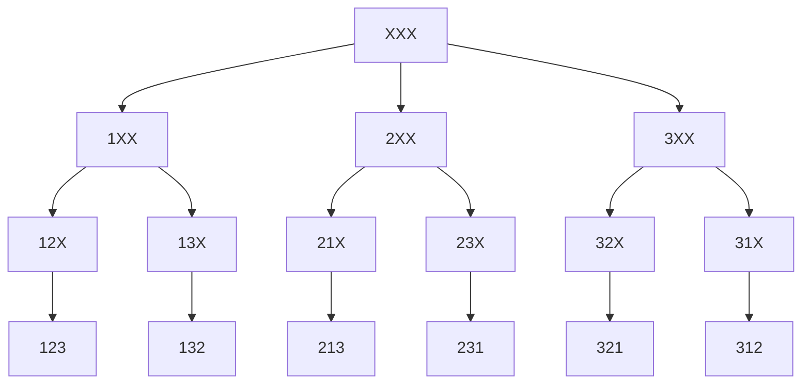
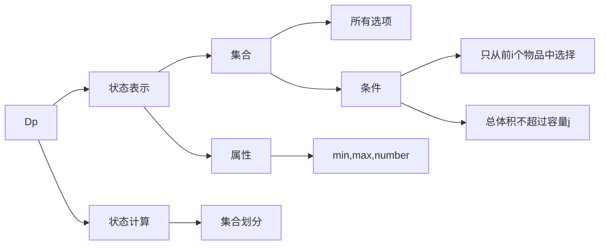
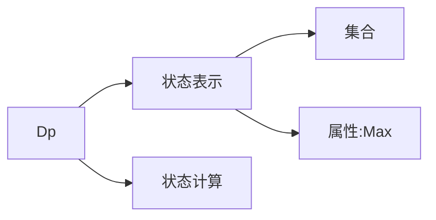

# 基础算法

ps:（https://www.acwing.com/） 同上链接付费课程同步以及自己的完善笔记

## 1.基础算法

### 1.排序

#### 快速排序

**时间复杂度O（nlogn）**

是不稳定的 但可以设立一个二维下标这样便能区分相同的数，使其变为稳定的

基本思路（**分治思想，可不仅用于排序**） 实在不行也可用暴力 开辟两个额外空间  同时注意一下边界问题

1.确定分界点的值x(一般为：q[l] ,q[r] ,q[(l+r)/2], 随机数)。

2.把小于等于x的放在左边，把大于等于x的放在右边(较好的策略(核心思路)：设置两个指针(i,j)分别指向数组开头和结尾。若i所指向的大于x则停下，否则继续自增走下去。若j所指向的小于x则停下，否则继续自减走下去。若二者都停下则交换。若i>j，则进行第三步操作。)

3.递归处理分界点左右两边

**更好地理解：快速排序先通过确立某个flag通过粗略排序得到有一定顺序的数组，再依次递归下去 当长度为2或者1时。整个数组已排好**

核心代码片段

```c++
//分界条件 为i时 不能为l + r >> 1（当l为 r - 1时） 和l 死循环
//当分界条件为j时 不能为 l + r + 1 >> 1和 r
void quick_sort(int l, int r)
{
    if(l >= r) return;
    int i = l - 1,j = r + 1;
    int x = arr[(i + j >> 1)];

    while(i < j)
    {
        do i ++;while(arr[i] < x);
        do j --;while(arr[j] > x);
        if(i < j) swap(arr[i], arr[j]);
    }
    
    quick_sort(l, j);
    quick_sort(j + 1, r);
}

```


快速选择算法 题目第K个数 **时间复杂度O(n)：每次只用递归其中一边**

```java
private static int quicksort(int l,int r,int k){
        if(l >= r) return q[r];
        int x = q[l],i = l - 1,j = r + 1;
        while(i < j){
            while(q[++ i] < x);
            while(q[-- j] > x);
            if(i < j) swap(i,j);
        }
        int sl = j - l + 1;
        if(sl >= k) return quicksort(l,j,k);
        else return quicksort(j + 1,r,k - sl);
    }
```

#### 归并排序

**时间复杂度O(nlogn)**

是稳定的 即对于两个相同的数排完序后位置与之前的保持不变

基本思想 **分治法，可不止用于排序 其他算法也可采样分治思想**

1.确定分界点 mid=（l+r)/2 是下标 不同于快排 以值为分界点

2.递归排序

3.归并 把两个数组合二为一

**更好的理解：显然归并排序先通过层层递归到最小长度为2的情况，即先排序好一个个长度为2或者1的数组，再归并成一个个为4或3的数组.......依次向上归并即可得到重组后的数组。其顺序与快速排序恰好相反。**

关键代码

```c++
void merge_sort(int l, int r)  // 归并排序
{
    if(l >= r) return;
    
    int mid = (l + r) >> 1;
    
    merge_sort(l, mid), merge_sort(mid + 1, r);
    
    int k = 0;
    int i = l, j = mid + 1;
    while(i <= mid && j <= r)
    {
        if(arr[i] <= arr[j]) temp[k ++] = arr[i ++];
        else temp[k ++] = arr[j ++];
    }
    while(i <= mid) temp[k ++] = arr[i ++];
    while(j <= r) temp[k ++] = arr[j ++];
    
    for(int i = l,j = 0;i <= r;i ++,j ++) arr[i] = temp[j];
}
```


### 2.二分法

整数二分

注意边界问题 有时需要多次调试

原理：**有单调性一定可以二分 没有单调性也可能二分 所以二分本质不是单调性。本质可定义为，将整个区间一分为二，左边满足某种性质，右边不满足这种性质，则可以找到这样的边界点**

本质：分治思想 比如左半边满足这种性质check 右半边是不满足的

最后l和r会相等

最终结果如何：可以寻找左右两半边的边界。**最终结果l = r**

```java
//两个模板
bool check(int x) {/* ... */} // 检查x是否满足某种性质

// 区间[l, r]被划分成[l, mid]和[mid + 1, r]时使用：
int bsearch_1(int l, int r)
{
    while (l < r)
    {
        int mid = l + r >> 1;
        if (check(mid)) r = mid;    // check()判断mid是否满足性质
        else l = mid + 1;
    }
    return l;
}
// 区间[l, r]被划分成[l, mid - 1]和[mid, r]时使用：
int bsearch_2(int l, int r)
{
    while (l < r)
    {
        int mid = l + r + 1 >> 1;
        if (check(mid)) l = mid;
        else r = mid - 1;
    }
    return l;
}
```

### 3.高精度

高精度加法

模拟竖式加法（加法器：Ai+BI+Ci-1）

```c++
#include <iostream>
#include <cstring>
#include <algorithm>
#include <vector>

using namespace std;

vector<int> add(vector<int>& A, vector<int>& B)
{
    vector<int> C;
    
    int t = 0;//进位标志
    
    for(int i = 0;i < A.size() || i < B.size();i ++ )
    {
        if(i < A.size()) t += A[i];
        if(i < B.size()) t += B[i];
        C.push_back(t % 10);
        t /= 10;
    }
    //是否还有进位
    if(t) C.push_back(t);
    
    return C;
}
//更完美写法
/*
vector<int> add(vector<int>& A, vector<int>& B)
{
    vector<int> C;
    
    int t = 0;//进位标志
    
    for(int i = 0;i < A.size() || i < B.size() || t;i ++ )
    {
        if(i < A.size()) t += A[i];
        if(i < B.size()) t += B[i];
        C.push_back(t % 10);
        t /= 10;
    }
    return C;
}*/

int main()
{
    string a, b;
    cin >> a >> b;
    
    vector<int> A, B;
    
    for(int i = a.size() - 1;i >= 0;i -- ) A.push_back(a[i] - '0');
    for(int i = b.size() - 1;i >= 0;i -- ) B.push_back(b[i] - '0');
    
    vector<int> C = add(A, B);
    
    for(int i = C.size() - 1;i >= 0;i -- ) printf("%d",C[i]);
    
    return 0;
}
```

高精度减法

模拟竖式减法 需记录是否借位 可只需写出较大大的减较小的即可

```c++
#include <iostream>
#include <cstring>
#include <algorithm>
#include <vector>

using namespace std;

bool cmp(vector<int>& A, vector<int>& B)
{
    if(A.size() != B.size()) return A.size() > B.size();
    for(int i = A.size() - 1;i >= 0;i -- )
        if(A[i] != B[i]) return A[i] > B[i];
    
    return true;
}

vector<int> sub(vector<int>& A, vector<int>& B)
{
    vector<int> C;
    
    int t = 0;//借位标志
    
    for(int i = 0;i < A.size();i ++ )
    {
        t = A[i] - t;
        if(i < B.size()) t -= B[i];
        C.push_back((t + 10) % 10);//简洁写法
        if(t < 0) t = 1; //下一个是否借位
        else t = 0;
    }
    
    //去除前导 0
    while(C.size() > 1 && C.back() == 0) C.pop_back();
    
    return C;
}

int main()
{
    string a, b;
    cin >> a >> b;
    
    vector<int> A, B;
    
    for(int i = a.size() - 1;i >= 0;i -- ) A.push_back(a[i] - '0');
    for(int i = b.size() - 1;i >= 0;i -- ) B.push_back(b[i] - '0');
    
    vector<int> C;
    //先比较 用较大的减小的
    if(cmp(A, B))
    {
        C = sub(A, B);    
    }
    else
    {
        C = sub(B, A);
        printf("-");
    }
    
    for(int i = C.size() - 1;i >= 0;i -- ) printf("%d",C[i]);
    
    return 0;
}
```

高精度乘法

模拟竖式乘法 需记录进位标志。同时这里往往是一个很大的 乘以一个位数较少的 需每次用大的数的每一位直接乘以小的数

如1≤A的长度≤100000, 0≤B≤10000

```c++
#include <iostream>
#include <cstring>
#include <algorithm>
#include <vector>

using namespace std;

vector<int> mul(vector<int>& A, int B)
{
    vector<int> C;
    
    int t = 0;//借位标志
    //完美避开 是否进位
    for(int i = 0;i < A.size() || t;i ++ )
    {
        if(i < A.size()) t += A[i] * B;//乘出是一个多位数 23456
        C.push_back(t % 10);//每次只取个位 其他保留
        t /= 10;
    }
    
    //去除前导0
    while(C.size() > 1 && C.back() == 0) C.pop_back();
    
    return C;
}
/*
vector<int> mul(vector<int>& A, int B)
{
    vector<int> C;
    
    int t = 0;//借位标志
    
    for(int i = 0;i < A.size();i ++ )
    {
        t += A[i] * B;//乘出是一个多位数 23456
        C.push_back(t % 10);//每次只取个位 其他保留
        t /= 10;
    }
    //是否还有进位
    while(t) C.push_back(t % 10),t /= 10;
    //去除前导0
    while(C.size() > 1 && C.back() == 0) C.pop_back();
    
    return C;
}*/

int main()
{
    string a;
    int b;
    cin >> a >> b;
    
    vector<int> A;
    
    for(int i = a.size() - 1;i >= 0;i -- ) A.push_back(a[i] - '0');
    
    vector<int> C = mul(A, b);

    for(int i = C.size() - 1;i >= 0;i -- ) printf("%d",C[i]);
    
    return 0;
}
```

高精度除法

模拟竖式除法：从最高位开始计算 仍然是一个高精度被除数和一个低精度除数

```c++
#include <iostream>
#include <cstring>
#include <algorithm>
#include <vector>

using namespace std;

vector<int> div(vector<int>& A, int B, int &r)
{
    vector<int> C;//商
    r = 0//余数
    //从最高位计算
    for(int i = A.size() - 1;i >= 0;i -- )
    {
        r = r * 10 + A[i];//模拟竖式除法 高位不够需右移的过程
        C.push_back(r / B);
        r %= B;
    }
    
    reverse(C.begin(), C.end());
    //去除前导0
    while(C.size() > 1 && C.back() == 0) C.pop_back();
    
    return C;
}

int main()
{
    string a;
    int b;
    cin >> a >> b;
    
    vector<int> A;
    
    for(int i = a.size() - 1;i >= 0;i -- ) A.push_back(a[i] - '0');
    
    int r;
    vector<int> C = div(A, b, r);

    for(int i = C.size() - 1;i >= 0;i -- ) printf("%d",C[i]);
    puts("");
    printf("%d", r);
    
    return 0;
}
```


### 4.前缀和与差分

前缀和：对于数组arr[N] = {a<sub>1</sub>,a<sub>2</sub>,a<sub>3</sub>,a<sub>4</sub>,...} 可以计算前缀和数组s,s<sub>i</sub> = s<sub>i-1</sub> + a<sub>i</sub>

前缀和思想

- 不仅仅只针对于求和运算 也同样适用于其他运算：乘积、异或（参见最大异或和）等
- **最主要的思想：预处理。预处理后的查询，时间复杂度为O(1)，经典的空间换时间**

前缀和

```java
for(int i = 1;i <= n;i ++){
            a[i] = sc.nextInt();
            s[i] = s[i - 1] + a[i];
        }
```

二维前缀和 s(i, j) = g(i, j) + s(i - 1, j) + s(i, j - 1) - s(i - 1, j - 1)

```c++
#include <iostream>

using namespace std;

const int N = 1010;

int n, m, q;
int s[N][N];

int main()
{
    scanf("%d%d%d", &n, &m, &q);

    for (int i = 1; i <= n; i ++ )
        for (int j = 1; j <= m; j ++ )
            scanf("%d", &s[i][j]);

    for (int i = 1; i <= n; i ++ )
        for (int j = 1; j <= m; j ++ )
            s[i][j] += s[i - 1][j] + s[i][j - 1] - s[i - 1][j - 1];

    while (q -- )
    {
        int x1, y1, x2, y2;
        scanf("%d%d%d%d", &x1, &y1, &x2, &y2);
        printf("%d\n", s[x2][y2] - s[x1 - 1][y2] - s[x2][y1 - 1] + s[x1 - 1][y1 - 1]);
    }

    return 0;
}
```

差分

对于一个数组a1，a2，... an,构造一个数组b1，b2，... bn使得a数组是b数组的前缀和。即a1=b1;a2=b1+b2;......an=b1+b2+...._bn（逆向推导即可得到差分公式）

作用：对于求原数组 可用**O(n)**时间内求出原数组

```c++
for(int i = 1;i <= n;i ++){
            a[i] = sc.nextInt();
            b[i] = a[i] - a[i - 1];
        }

for(int i = 0;i < m;i ++){
            int l = sc.nextInt();
            int r = sc.nextInt();
            int c = sc.nextInt();
            b[l] += c;
            if(r < n) b[r + 1] -= c;
        }
//后面再对b数组做一次前缀和 即得所求原始数组
```

二维差分：不用关心具体公式如何推导 只用关心需求即可。由需求可得a[i, j]为b[i, j]的前缀和，则有a[i, j] = b[1,1] + b[1, 2] + b[1, 3] + .... b[1,j] + b[2, 1] + b[2, 2] + ... b[i, j] 。则对于b[i, j] + c则有(i, j)到（n，m）的和将都加上c。

最后对b数组求二维前缀和即可得原数组

```c++
#include <iostream>

using namespace std;

const int N = 1010;

int n, m, q;
int a[N][N], b[N][N];

void insert(int x1, int y1, int x2, int y2, int c)
{
    b[x1][y1] += c;
    b[x2 + 1][y1] -= c;
    b[x1][y2 + 1] -= c;
    b[x2 + 1][y2 + 1] += c;
}

int main()
{
    scanf("%d%d%d", &n, &m, &q);

    for (int i = 1; i <= n; i ++ )
        for (int j = 1; j <= m; j ++ )
            scanf("%d", &a[i][j]);

    //初始数组b为全0 更新后可得b数组的前缀和为a
    for (int i = 1; i <= n; i ++ )
        for (int j = 1; j <= m; j ++ )
            insert(i, j, i, j, a[i][j]);

    while (q -- )
    {
        int x1, y1, x2, y2, c;
        cin >> x1 >> y1 >> x2 >> y2 >> c;
        insert(x1, y1, x2, y2, c);
    }

    for (int i = 1; i <= n; i ++ )
        for (int j = 1; j <= m; j ++ )
            b[i][j] += b[i - 1][j] + b[i][j - 1] - b[i - 1][j - 1];

    for (int i = 1; i <= n; i ++ )
    {
        for (int j = 1; j <= m; j ++ ) printf("%d ", b[i][j]);
        puts("");
    }

    return 0;

```

### 5.双指针算法

先用暴力 再用双指针优化 O(N<sup>2</sup>) ——>O(N) 核心思想：**两个指针的移动次数不会超过2n**

常用经典双指针：

- i和j分别位于一个数组的两端
- i和j分别位于两个数组的开头

最长连续不重复元素

```c++
#include <iostream>
#include <cstring>
#include <algorithm>
#include <map>

using namespace std;

const int N = 1e5 + 10;

int a[N], s[N];

int main()
{
    
    int n;
    cin >> n;
    int res = 0;
    for(int i = 1,j = 1;i <= n;i ++ )
    {
        cin >> a[i];
        s[a[i]] ++;
        
        while(s[a[i]] > 1) -- s[a[j ++]];
        
        res = max(i - j + 1, res);
    }
    
    cout << res << endl;
    
    return 0;
}
```

数组元素的目标和

```c++
#include <iostream>
#include <cstdio>
using namespace std;

const int N = 1e5 + 10;

int n, m, k;
int a[N], b[N];
#define read(x) scanf("%d",&x)

int main()
{
    read(n), read(m), read(k);
    for (int i = 0; i < n; i ++ ) read(a[i]);
    for (int i = 0; i < m; i ++ ) read(b[i]);

    for (int i = 0, j = m - 1; i < n; i ++) {
        while(j >= 0 && a[i] + b[j] > k) j --;
        if(j >= 0 && a[i] + b[j] == k) printf("%d %d\n", i, j);
    }
    return 0;
}
```


### 6.位运算

**不会单独考，但涉及到0，1的 数组 矩阵 可考虑用二进制的数字代替：参考费解的开关；以及加快某些计算速度**

常规操作

1.求某个数第k位是0或1：可先>>右移k位至个位然后异或&1.

2.lowbit运算：返回第一个1 如100101000 则返回 1000

```c++
int lowbit(int x){
	return x & -x;
}
```

-x等于x的补码等于x求反+1

如：x = 100101000 

~x + 1 = 011010111 + 1 = 011011000

### 7.离散化

数据量范围很大（如10<sup>9</sup>）>10<sup>5</sup> 但是很稀疏 能用到的数据量可能只有10<sup>5</sup> 不然可以考虑前缀和 直接前缀和可能会超过内存限制

离散化：把所有用到的下标映射成从1开始的自然数

```c++
#include <iostream>
#include <cstring>
#include <algorithm>
#include <vector>

using namespace std;

const int N = 3e5 +10;

int a[N];//存储映射后的数组

typedef pair<int, int> PII;

vector<int> all;//将所有用到的下标 离散化为更小区间的数
vector<PII> query, add;

int find(int x)
{
    int l = 0,r = all.size() - 1;
    while(l < r)
    {
        int mid = (l + r) >> 1;
        if(all[mid] >= x) r = mid;
        else l = mid + 1;
    }
    return l + 1;//从1开始 便于后面求前缀和
}

int main()
{
    int n, m;
    cin >> n >> m;
    
    while (n -- )
    {
        int x, c;
        scanf("%d%d", &x, &c);
        add.push_back({x, c});
        all.push_back(x);
    }
    while (m -- )
    {
        int l, r;
        scanf("%d%d", &l, &r);
        query.push_back({l, r});
        all.push_back(l);
        all.push_back(r);
    }
    
    //去重并排序所有下标
    //先排序 unique是每次比较相邻的
    sort(all.begin(), all.end());
    all.erase(unique(all.begin(), all.end()), all.end());
    
    //寻找下标 二分法 logn
    for(auto t : add)
    {
        int x = t.first, c = t.second;
        a[find(x)] += c;
    }
    for(int i = 1;i <= all.size();i ++) a[i] += a[i - 1];
    
    for (auto item : query)
    {
        int l = find(item.first), r = find(item.second);
        cout << a[r] - a[l - 1] << endl;
    }
    
    return 0;
}
```

### 8.区间合并

目标：快速合并有交集的区间。方法：1.按区间左端点排序2.扫描并合并

```c++
#include <iostream>
#include <cstring>
#include <algorithm>
#include <vector>

using namespace std;

typedef pair<int, int> PII;

const int N = 100010;

vector<PII> seg;

int main()
{
    int n;
    cin >> n;
    while (n -- )
    {
        int l, r;
        cin >> l >> r;
        seg.push_back({l, r});
    }
    
    sort(seg.begin(), seg.end());
    
    int st = -2e9, ed = -2e9;
    
    vector<PII> res;
    
    for(auto t : seg)
    {
        int l = t.first, r = t.second;
        
        if(ed < l) 
        {
            if(st != -2e9)
                res.push_back({l, r});
            st = l, ed = r;
        }
        else ed = max(ed, r);
    }
    
    if(st != -2e9) res.push_back({st, ed});
    cout << res.size() << endl;
    
    return 0;
    
}
```

### 9.递归

### 10.递推

递推思想参照：费解的开关、翻硬币、砖块：**确定完状态枚举**。一定要理清楚思路下手，不然没用

#### 砖块

思路分析

- 最后的状态共两种：全白、全黑。分别枚举即可
- 同一个位置操作多次等于没操作
- 如果枚举的最终状态是全白，而第一个点是白则不操作（后面状态依次传递），而第一个点是黑则翻转（后面状态依次传递）

代码

```java
import java.util.*;

public class Main{
    static int t;
    public static void main(String[] args){
        Scanner sc = new Scanner(System.in);
        t = sc.nextInt();
        for(int i = 0;i < t;i ++)
        {
            int n = sc.nextInt();
            String s = sc.next();
            char[] a = s.toCharArray();
            char[] b = a.clone();//深拷贝
            if(!check(a,'W') && !check(b,'B'))
                System.out.println(-1);
        }
    }
    private static boolean check(char[] array,char flag){
        Queue<Integer> queue = new LinkedList<>();
        for(int i = 0;i < array.length - 1;i ++)
        {
            if(array[i] != flag){
                update(array,i);
                update(array,i + 1);
                queue.offer(i);
            }
        }
        int tmp = queue.size();
        if(array[array.length - 1] != flag) return false;
        System.out.println(queue.size());
        while(queue.size() > 0)
        {
            int t = queue.poll() + 1;
            System.out.print(t + " ");
        }
        if(tmp != 0) System.out.println("");
        return true;
    }
    private static void update(char[] array,int i){
        if(array[i] == 'W') array[i] = 'B';
        else array[i] = 'W';
    }
}
```

#### 翻硬币

思路同理

- 需自己设立规则：从左往右翻，方便状态计算

- 操作同一个点多次等于没操作，则得出可**依次向后操作的递推思想**
- 如果此点不等于该源点 则操作

```java
import java.util.*;

public class Main{
    static int N = 100010,n;
    static int[] g = new int[N];
    public static void main(String[] args){
        Scanner sc = new Scanner(System.in);
        String sorce = sc.next();
        String target = sc.next();
        char[] a = sorce.toCharArray();
        char[] b = target.toCharArray();
        int cnt = 0;
        for(int i = 0;i < a.length - 1;i ++)
        {
            if(a[i] != b[i])
            {
                update(a,i);
                update(a,i + 1);
                cnt ++;
            }
        }
        System.out.println(cnt);
    }
    private static void update(char[] array,int i){
        if(array[i] == 'o') array[i] = '*';
        else array[i] = 'o';
    }
}
```

#### 费解的开关

思路同理：转化为二维递推

- 在相邻的点以及同一个点操作多次都没意义，于是每一行 从左往右枚举操作
- 自己设立规则，从上往下操作，直到倒数第二行（再操作最后一行没有意义，会改变倒数第二行）
- 当最后一行不全为1则不能操作出此方案
- 枚举第一行的操作后 后面行的操作可依次递推

```java
import java.util.*;

public class Main{
    static int N = 10,n,aus = 0x3f3f3f3f;
    static int[][] g = new int[5][5];
    static int[] ax = new int[]{-1,0,1,0,0};
    static int[] ay = new int[]{0,1,0,-1,0};
    public static void main(String[] args){
        Scanner sc = new Scanner(System.in);
        n = sc.nextInt();
        
        while((n --) > 0)
        {
            //从第一行 第一列 操作 则不用管第0行 第0列的状态
            for(int i = 0;i < 5;i ++)
            {
                String s = sc.next();
                for(int j = 0;j < 5;j ++)
                {
                    g[i][j] = s.charAt(j) - '0';
                }
            }
                    
            System.out.println(work(0x3f3f3f3f));
        }
    }
    private static int work(int t){
        int cnt = t;
        //枚举第一行的操作后(共32种操作) 后面行的操作可依次递推
        for(int k = 0;k < (1 << 5);k ++){
            //用深拷贝的数组作操作 二维数组的深拷贝出错
            int[][] backup = new int[5][5];
            for(int i = 0;i < 5;i ++)
                for(int j = 0;j < 5;j ++)
                    backup[i][j] = g[i][j];
            int res = 0;//当前枚举的步数
            //根据枚举操作第一行
            for(int j = 0;j < 5;j ++)
            {
                if(((k >> j) & 1) == 1)
                {
                    update(0,j,backup);
                    res ++;
                }
            }
            //递推至倒数第二行
            //每次操作:如果这行数字是0 则操作下面的数字
            for(int i = 0;i < 4;i ++)
                for(int j = 0;j < 5;j ++)
                    if(backup[i][j] == 0)
                    {
                        update(i + 1,j,backup);
                        res ++;
                    }    
            boolean flag = true;
            for(int i = 0;i < 5;i ++)
                if(backup[4][i] == 0) 
                    flag = false;
               
            if(flag && res < cnt) cnt = res;
            
        }
        if(cnt > 6) return -1;
        return cnt;
    }
    private static void update(int x,int y,int[][] array){
        for(int i = 0;i < 5;i ++){
            int m = x + ax[i];
            int n = y + ay[i];
            if(m >= 0 && m < 5 && n >= 0 && n < 5){
                array[m][n] = 1 - array[m][n];
            }
        }
    }
}
```

### 11.模拟

字符串模拟

树


## 2.数据结构

### 1.链表与邻接表 

实现方法有：结构体指针（每次都要new node 往往都是上万级的量非常慢 算法题中可能会超时）、STL容器

#### 1.单链表

这里用数组来模拟单链表 以head表示头节点下标 以e[ i ]表示第i个节点的值 ne[ i ]表示第i个节点的指向第几个节点 空节点表示为-1 以idx表示当前用到了哪个点 下标可以自定义从0（或1）开始（不包含头节点head 此时头节点指向0（或1））

具体含义 见下列代码（注意实际题目中下标可能会出现问题）

```c++
int head,e[N],ne[N],idx;
//初始化操作 
void init(){
	head=-1;
	idx=0;//从0开始（不包括头节点）
}
//将节点插入到头节点后 
void add_to_head(int x){
    e[idx]=x;
	ne[idx]=head;
	head=idx;
	idx++;
}
//一般的插入操作 把值为x的节点插入到第k节点的后面 
void add(int x,int k){
    e[idx]=x;
	ne[idx]=ne[k];
	ne[k]=idx;
	idx++;	
}
//删除第k节点后的那个节点 
void remove(int k){
	//这里不用考虑内存泄漏 
	ne[k]=ne[ne[k]];
}
```

删除头节点可表示为 head=ne[head] 具体解释可参照 数据结构（一）45:50

#### 2.双链表

部分定义同上 记head头节点下标为0 记tail尾节点下标为1 l[N]表示左边的点 r[N]表示右边的点

```c++
int e[N],l[N],r[N],idx;
void init(){
	r[0]=1,l[1]=0;
	idx=2;
} 
//在第k节点的右边插入节点 
void add(int k,int x){
	e[idx]=x;
	r[idx]=r[k];
	l[idx]=k;
	l[r[k]]=idx;
	r[k]=idx;
	idx++;	
}
void remove(int k){
	r[l[k]]=r[k];
	l[r[k]]=l[k];
}
```


### 2.栈与队列

**题型稍微会比较单一 一般涉及到暴力比较大小会超时 可考虑用单调队列 单调栈优化**

实现方法：同上

#### 1.栈 队列

具体可见视频

#### 2.单调栈 单调队列

思路：先用暴力 再找规律找到单调性 再优化 比如有些值永远不可能使用

1.单调栈

**常见模型：找出每个数最左边离它最近的比它大/小的数**

**本质核心：删除后的元素具有单调性，后面可用二分等操作进一步优化。避免重复计算比较 每个元素只会出栈 入栈一次** 

题目描述：给定一个长度为 N 的整数数列，输出每个数左边第一个比它小的数，如果不存在则输出 −1。

输入格式

第一行包含整数 N，表示数列长度。

第二行包含 N 个整数，表示整数数列。

输出格式

共一行，包含 N 个整数，其中第 i个数表示第 i个数的左边第一个比它小的数，如果不存在则输出 -1。

数据范围

1≤N≤10<sup>5</sup>
1≤数列中元素≤10<sup>9</sup>

输入样例：

```
5
3 4 2 7 5
```

输出样例：

```
-1 3 -1 2 2
```

题目分析：可以用暴力做法 两层循环时间复杂度为O(n<sup>2</sup>)

简化思路：有些数字是永远不会用上 例如有以下数据 a<sub>1</sub> a<sub>2</sub> a<sub>3</sub> .....a<sub>i</sub>  以a<sub>i</sub>为中心 那么若有x<y<i 且a<sub>x</sub> >a<sub>y</sub>以及a<sub>x</sub> , a<sub>y</sub> <a<sub>i</sub>那么a<sub>x</sub>必不会被用 于是可删除a<sub>x </sub> 最终形成单调上升的数列 然后放在栈中从栈顶开始与a<sub>i</sub> 比较 如果stk[tt] >= a<sub>i</sub> 那么tt-1 比较下一个直到出现比a<sub>i</sub> 小的

代码如下:

```c++
#include <iostream>
using namespace std;
const int N = 100010;
int stk[N], tt;
int main()
{
    int n;
    cin >> n;
    while (n -- )
    {
        int x;
        scanf("%d", &x);
        while (tt && stk[tt] >= x) tt -- ;
        if (!tt) printf("-1 ");
        else printf("%d ", stk[tt]);
        stk[ ++ tt] = x;
    }
    return 0;
}
```

2.单调队列

**常见模型：滑动窗口里的最大/最小值。**

**本质核心：删除后的元素具有单调性，后面可用二分等操作进一步优化。避免重复计算，用单调队列来维护元素（由于需要将元素插入队尾 并将队头弹出）。**

滑动窗口

```c++
//队列存储下标
#include<iostream>

using namespace std;

const int N = 10e6 + 10;
int a[N],q[N];//q[N]队列中存储的为下标
int hh,tt = -1;

int main()
{
    int n,k;
    scanf("%d%d", &n, &k);
    
    for(int i = 0;i < n;i ++) scanf("%d", &a[i]);
    //判断最小
    for(int i = 0;i < n;i ++)
    {
        //队列不空 && 如果队尾比当前点大 则不必用
        while(hh <= tt && a[q[tt]] >= a[i]) tt --;
        //队列不空 && 滑出队头
        if(hh <= tt && i - k + 1 > q[hh]) hh ++;
        //当前i可能是最小
        q[++ tt] = i;
        if(i >= k - 1) printf("%d ",a[q[hh]]);
    }
    puts(" ");
    hh = 0,tt = -1;
    for (int i = 0; i < n; i ++ )
    {
        while(hh <= tt && a[q[tt]] <= a[i]) tt --;
        if(hh <= tt && i - k + 1 > q[hh]) hh ++;
        q[++ tt] = i;
        if(i >= k - 1) printf("%d ",a[q[hh]]);
    }
    return 0;
}
```

### 3.kmp

时间复杂度为0(N) 因为next数组总共最多减m次（每跳一次就最少减一次）

思路仍然是先暴力再考虑优化

```c++
//对于其中一个字符串 需预处理出后缀和前缀相等的
//next[i] = j的含义为[1...j] == [i-j+1...i]且j值是最大的
//next[i] = 0的含义为不存在[1...j] == [i-j+1....i] 其中j >= 2故显然ne[1] = 0 
//如 'aba' ne[1] = 0, ne[2] = 0, ne[3] = 1

#include <iostream>

using namespace std;

const int N = 100010,M = 1000010;

int n,m;
char p[N],s[M];
int ne[N];

int main()
{
    cin >> n >> p + 1 >> m >> s + 1;
    //next数组 记ne[1] = 0 求最少移动距离时的前缀点
    for(int i = 2,j = 0;i <= n;i ++)
    {
        while(j && p[j + 1] != p[i]) j = ne[j];
        if(p[j + 1] == p[i]) j ++;
        ne[i] = j;
    }

    //kmp
    for(int i = 1,j = 0;i <= m;i ++)
    {
        //j到头或者下一个点不匹配
        while(j && p[j + 1] != s[i]) j = ne[j];//全局观 最多减m次
        if(p[j + 1] == s[i]) j ++; //全局观 最多加m次
        if(j == n)
        {
            printf("%d ",i - n);
            j = ne[n];
        }
    }

}
```

### 4.Trie（前缀树）

**高效存储和查找字符串或可以以0、1表示的整数集合的数据结构**

时间复杂度NlogN

对于整数的应用可考虑 用二进制表示 0 、 1串

思想

- 以一棵树来构建，则记录每一个节点的序号(参照图的表示)
- 遍历 也参照图的情况

**Trie字符串统计**

维护一个字符串集合，支持两种操作：

1. `I x` 向集合中插入一个字符串 x；
2. `Q `x 询问一个字符串在集合中出现了多少次。

共有 N个操作，所有输入的字符串总长度不超过 10<sup>5</sup>，字符串仅包含小写英文字母。

输入格式

第一行包含整数 N，表示操作数。

接下来 N 行，每行包含一个操作指令，指令为 `I x` 或 `Q x` 中的一种。

输出格式

对于每个询问指令 `Q x`，都要输出一个整数作为结果，表示 x在集合中出现的次数。

每个结果占一行。

数据范围

1≤N≤2∗10<sup>4</sup>

输入样例：

```
5
I abc
Q abc
Q ab
I ab
Q ab
```

输出样例：

```
1
0
1
```

代码

```java
//用数组存储 son[N][26] 最多有N个节点 故存储每一个节点的儿子节点
//son[0][]第0层为根节点的儿子节点 第一层为第一个加入的节点的儿子节点~第idx层为第idx个加入的节点的儿子节点


#include <iostream>
#include <cstring>
#include <algorithm>

using namespace std;

const int N = 1e5 + 10;
int son[N][26], cnt[N], idx;
char str[N], op[2];

void insert(char str[])
{
    int p = 0;//从根节点开始
    for(int i = 0;str[i];i ++)
    {
        int u = str[i] - 'a';
        if(!son[p][u]) son[p][u] = ++idx;//如果该点的儿子节点没有对应的点则分配一个点 编号为++idx
        p = son[p][u];//走到对应的编号下 
    }
    cnt[p] ++;//如一个字符串加入的编号依次为 5 6 7 8 则cnt[8] ++表示第8号点为其末尾 同时idx具有唯一性
}

int query(char str[])
{
    int p = 0;//从根节点开始
    for(int i = 0;str[i];i ++)
    {
        int u = str[i] - 'a';
        if(!son[p][u]) return 0;//不存在
        p = son[p][u];
    }
    return cnt[p];
}

int main()
{
    int n;
    cin >> n;
    while (n -- )
    {
        scanf("%s%s", op, str);
        if(!strcmp(op, "I"))
        {
            insert(str);
        }else
        {
            int t = query(str);
            cout << t << endl;
        }
    }
    return 0;
}
```

**最大异或对**

暴力做法：O(n^2)

暴力思路：

- 遍历ai
- 确定ai后 再次遍历剩余的 确定ai的最大异或对

优化思路：优化第二步 如果以前缀树的形式存储，则可将O(N)—>O(logN) 总时间复杂度为O(NlogN)

```java
//一颗二叉树 最多31层 
import java.util.*;

public class Main{
    static int N = 100010,M = 31 * N,idx,n;
    static int[][] son = new int[M][2];
    static int[] arr = new int[N];
    public static void main(String[] args){
        Scanner sc = new Scanner(System.in);
        n = sc.nextInt();
        for(int i = 0;i < n;i ++)
        {
            arr[i] = sc.nextInt();
            insert(arr[i]);
        }
        int ans = 0;
        for(int i = 0;i < n;i ++)
        {
            int p = 0,res = 0;
            for(int j = 30;j >= 0;j --)
            {
                int m = (arr[i] >> j) & 1;
                if(son[p][1 - m] != 0){
                    p = son[p][1 - m];
                    res += 1 << j;
                }
                else
                    p = son[p][m];
            }
            ans = Math.max(res,ans);
        }
        System.out.println(ans);
    }
    private static void insert(int x){
        int p = 0;//从根节点开始 son[0][m]表示根节点的儿子节点 
        for(int i = 30;i >= 0;i --)
        {
            int m = (x >> i) & 1;
            if(son[p][m] == 0) son[p][m] = ++ idx; //每个节点有唯一序号
            p = son[p][m];//走到下一个节点
        }
    }
}
```

**最大异或和**

思路

- 涉及到异或的操作：一个数异或自身等于0 可视为减去自身 于是可考虑用**前缀和思想，预处理出结果** 最后查询任意一段数组的异或和可在O(1)的时间复杂度内完成
- 题意转化为，si中两个数的最大异或值。
- 限制：由于含有区间限制，所以需类似于滑动窗口来维护前缀树，弹出队头，插入队尾。删除分支时，不用真正删除，用标记解决

```java
//一颗二叉树 最多31层 
import java.util.*;

public class Main{
    static int N = 100010,M = 31 * N,idx,n,m;
    static int[][] son = new int[M][2];
    static int[] cnt = new int[M];
    static int[] s = new int[N];
    public static void main(String[] args){
        Scanner sc = new Scanner(System.in);
        n = sc.nextInt();
        m = sc.nextInt();
        insert(0,1);
        for(int i = 1;i <= n;i ++)
        {
            int a = sc.nextInt();
            s[i] = a ^ s[i - 1];
        }
        int ans = 0;
        for(int i = 1;i <= n;i ++)
        {
            insert(s[i],1);//插入队尾
            if(i - m - 1 >= 0) insert(s[i - m - 1],-1);//删除开头
            int p = 0,res = 0;
            for(int j = 30;j >= 0;j --)
            {
                int m = (s[i] >> j) & 1;
                if(cnt[son[p][1 - m]] != 0){
                    p = son[p][1 - m];
                    res += 1 << j;
                }
                else
                    p = son[p][m];
            }
            ans = Math.max(res,ans);
        }
        System.out.println(ans);
    }
    private static void insert(int x, int v){
        int p = 0;//从根节点开始 son[0][m]表示根节点的儿子节点 
        for(int i = 30;i >= 0;i --)
        {
            int m = (x >> i) & 1;
            if(son[p][m] == 0) son[p][m] = ++ idx; //每个节点有唯一序号
            p = son[p][m];//走到下一个节点
            cnt[p] += v;//标记
        }
    }
}
```

### 5.并查集

**涉及到可以从集合的关系去分析问题时，可用并查集**

思路

- 以树的形式来维护集合
- 路径压缩优化

快速处理：

1. 将两个集合合并 O(1)
2. 询问两个元素是否在一个集合 O(N)（递归询问祖宗节点，**路径压缩后O(N)时间复杂度可视作O(1)**）

暴力做法： 合并O(N) 询问O(1)

并查集基本原理 每个集合用一棵树表示 树根的编号就是整个集合的编号 每个节点存储它的父节点  p[x] 表示x的父节点

```java
import java.util.*;

public class Main{
    static int N = 100010,n,m;
    static int[] p = new int[N];
    public static void main(String[] args){
        Scanner sc = new Scanner(System.in);
        n = sc.nextInt();
        m = sc.nextInt();
        for(int i = 1;i <= n;i ++) p[i] = i;//初始化 每个点的父节点是自己本身
        for(int i = 0;i < m;i ++){
            String op = sc.next();
            int a = sc.nextInt();
            int b = sc.nextInt();
            if(op.equals("M")) p[find(a)] = find(b);//将b的祖宗节点作为a的祖宗节点的父节点
            else {
                if(find(a) == find(b)) System.out.println("Yes");
                else System.out.println("No");
            }
        }
    }
    //并查集的核心操作，寻找根节点祖先 + 路径压缩
    private static int find(int x){
        if(p[x] != x) p[x] = find(p[x]);//返回父节点 直到找到root 
        //查找的过程中 路径上的点的父节点会变为根节点 ——>路径压缩 O(N)的复杂度实际上可看作O(1) 下一次查询不用递归多次
        return p[x];
    }
}
```

**连通块的个数**

并查集的变形：维护额外的信息

```c++
#include <iostream>
#include <cstring>
#include <algorithm>

using namespace std;

const int N = 1e5 + 10;

int p[N], cnt[N];//只有根节点才有意义

int find(int x)
{
    if(p[x] != x) p[x] = find(p[x]);
    return p[x];
}

int main()
{
    int n, m;
    cin >> n >> m;
    
    for(int i = 1;i <= n;i ++) p[i] = i, cnt[i] = 1;
    
    while (m -- )
    {
        int a, b;
        char op[5];
        scanf("%s", op);
        if(!strcmp(op, "C"))
        {
            scanf("%d%d", &a, &b);
            a = find(a), b = find(b);
            if(a != b)
            {
                p[a] = b;
                cnt[b] += cnt[a];
            }
        }
        else if(!strcmp(op, "Q1"))
        {
            scanf("%d%d", &a, &b);
            if(find(a) == find(b)) puts("Yes");
            else puts("No");
        }
        else
        {
            scanf("%d", &a);
            cout << cnt[find(a)] << endl;
        }
    }
    
    return 0;
}
```

**食物链**

并查集扩展，加入路径长度

思路

- 将全部节点加入一个集合，可以根据子节点到根节点的距离来分析节点之间的关系。
- 距离余1，表示可以吃根节点；距离余2，表示可以被根节点吃；距离余0，表示根节点是同类。
- 思想：没必要存每个人之间的关系，只需知道和中央的关系即可，因为可推导至和其他人的关系。

```java
#include <iostream>

using namespace std;

const int N = 50010;

int n, m;
int p[N], d[N];//表示此节点到根节点的距离

int find(int x)
{
    if (p[x] != x)
    {
        int t = find(p[x]);
        d[x] += d[p[x]];//更新为 此点到父节点的距离 + 此点的父节点到根节点的距离
        p[x] = t; 
    }
    return p[x];
}

int main()
{
    scanf("%d%d", &n, &m);

    for (int i = 1; i <= n; i ++ ) p[i] = i;

    int res = 0;
    while (m -- )
    {
        int t, x, y;
        scanf("%d%d%d", &t, &x, &y);
		//超出长度
        if (x > n || y > n) res ++ ;
        else
        {
            int px = find(x), py = find(y);//先找出各自的节点
            if (t == 1)
            {
                //如果 x 和 y到根节点的距离模3不同余则不是同一类
                if (px == py && (d[x] - d[y]) % 3) res ++ ;
                else if (px != py)// 否则需加入集合
                {
                    p[px] = py;
                    d[px] = d[y] - d[x];//保证x 和 y 到根节点的距离是同余的
                }
            }
            else
            {
                //如果 x 和 y到根节点的距离之差减一模3不同余则是矛盾的吃关系
                if (px == py && (d[x] - d[y] - 1) % 3) res ++ ;
                else if (px != py)
                {
                    p[px] = py;
                    d[px] = d[y] + 1 - d[x];
                }
            }
        }
    }

    printf("%d\n", res);

    return 0;
}
```


### 6.堆

数据结构形式：完全二叉树（可用一维数组数组存储，当前为x则左节点为2x，右节点2x+1）

- 小根堆：每个点都满足小于左右两边的点
- 大根堆：每个点都满足大于左右两边的点

手写堆基本操作

- 插入一个数：先放入末尾；up(size)
- 求最小值：小根堆取堆顶即可
- 删除最小值：将堆顶元素与末尾元素互换位置；size--（删除末尾元素）；down(1)
- 删除任意元素：将改元素与末尾元素互换位置；size--（删除末尾元素）；down(k)/up(k)
- 修改任意元素：修改；down(k)/up(k)


堆排序：建堆复杂度为O(n)，排序时间复杂度O(nlogn)

```c++
#include<iostream>

using namespace std;

const int N = 100010;
int n,m;
int h[N],len;
void up(int u)
{
    //不是堆顶 且 比父节点小
    while(u / 2 && h[u / 2] > h[u])
    {
        swap(h[u],h[u / 2]);
        u /= 2;
    }
}

void down(int u)
{
    //u为该节点编号 找到该点、右节点、左节点的最小值
    int t = u;
    //右节点是否存在 且 右节点是否比它小
    if(2*u + 1 <= len && h[2*u + 1] < h[t]) t = 2*u + 1;
    //左节点是否存在 且 左节点是否比它小
    if(2*u <= len && h[2*u] < h[t]) t = 2*u;
    if(t != u)
    {
        swap(h[u],h[t]);
        down(t);
    }
}

int main()
{
    scanf("%d%d",&n,&m);
    for(int i = 1;i <= n;i ++) scanf("%d",&h[i]);
    len = n;
    //建堆
    for(int i = n / 2;i >= 1;i --)
        down(i);
    
    while(m --)
    {
        //小根堆 每次取堆顶
        printf("%d ",h[1]);
        //删除堆顶
        h[1] = h[len];
        len --;
        down(1);
    }
    return 0;
    
}
```

### 7.Hash表

存储结构

- 开放寻址法：只开一个一维数组(是原数组的2~3倍)，有冲突则一直往后找直到没有冲突为止
- 拉链法：操作：1）添加：有冲突则以链表形式存储 2）查找 3）删除，标记即可不用真正删除

哈希表作用：将一个庞大的数据(0~10<sup>9</sup>)映射到小数据范围之间(0~10<sup>5</sup>)


开放寻址法

```c++
#include <iostream>
#include <cstring>

using namespace std;

const int N = 200003,null = 0x3f3f3f3f;
int h[N];

//返回的是应该存储的下标位置
int find(int x)
{
    int k = (x % N + N) % N;
    //有冲突:有人且人不是x
    while(h[k] != null && h[k] != x)
    {
        k ++;
        if(k == N) k = 0;//循环从头开始找
    }
    return k;
}

int main()
{
    int n;
    cin >> n;
    //memset是按字节memset
    memset(h, 0x3f, sizeof h);
    while(n --)
    {
        char op[2];
        int x;
        scanf("%s%d",op, &x);
        int k = find(x);//找地址
        if(!strcmp(op, "I")) h[k] = x;
        else
        {
            if(h[k] == x)
                printf("Yes");
            else printf("No");
            puts("");
        }

    }
    return 0;
}
```


拉链法

```c++
#include <iostream>
#include <cstring>

using namespace std;

const int N = 100003;
int h[N], e[N], ne[N],idx;

void insert(int x)
{
    int k = (x % N + N) % N;
    e[idx] = x;
    ne[idx] = h[k];
    h[k] = idx ++; 
}

bool find(int x)
{
    int k = (x % N + N) % N;

    for(int i = h[k];i != -1;i = ne[i])
        if(e[i] == x) 
            return true;
    return false;
}

int main()
{
    int n;
    cin >> n;
    memset(h,-1,sizeof(h));
    while(n --)
    {
        char op[2];
        int x;
        scanf("%s%d",op, &x);

        if(!strcmp(op, "I")) insert(x);
        else
        {
            if(find(x))
                printf("Yes");
            else printf("No");
            puts("");
        }

    }
    return 0;
}
```

字符串哈希

- 目标：求出每一个前缀的哈希值。如对于一个字符串：“abaca”则有h[0]="a"，h[1]="ab"，h[2]="aba"，h[3]="abac",......

- 核心：将字符串看作P进制的数，则可以将字符串转换为数字（但是可能很大需要哈希思想映射到0-p-1，这里P通常取131，模取2^64）后就可以用前缀和的思想

```c++
#include <iostream>
#include <algorithm>

using namespace std;

//unsigned long long溢出相当于取2^64的模
typedef unsigned long long ULL;

const int N = 100010, P = 131;

int n, m;
char str[N];
ULL h[N], p[N];

ULL get(int l, int r)
{
    return h[r] - h[l - 1] * p[r - l + 1];
}

int main()
{
    scanf("%d%d", &n, &m);
    scanf("%s", str + 1);

    p[0] = 1;
    for (int i = 1; i <= n; i ++ )
    {
        h[i] = h[i - 1] * P + str[i];
        p[i] = p[i - 1] * P;
    }

    while (m -- )
    {
        int l1, r1, l2, r2;
        scanf("%d%d%d%d", &l1, &r1, &l2, &r2);

        if (get(l1, r1) == get(l2, r2)) puts("Yes");
        else puts("No");
    }

    return 0;
}
```

### 8.STL

vector

stack

queue

set

map

unordered_map

unordered_set


## 3.搜索与图论

### 1.DFS和BFS

DFS BFS 对比

|      | 数据结构层面 | 空间复杂度层面           |                |
| ---- | ------------ | ------------------------ | -------------- |
| DFS  | stack 栈     | O(h) h为高度             | 无最短路径概念 |
| BFS  | queue 队列   | O(2<sup>h</sup>) h为高度 | 有最短路径概念 |

求一般树的直径（找到两个点之间的边数最大）：任取一点为起点，找到里该点最远的点u(bfs，dfs都可推荐bfs不容易爆栈)。再找距离u最远的点v。uv之间即为所求。证明：u一定为最长的直径的一个端点。分情况讨论1.au与直径不相交2.au与直径相交。

区别：**DFS回溯的时候会恢复曾经的状态。BFS由于每次经过的点都有最短路的性质（搜到的点 必为最短的 即最快到达的），所以会记录下来下次不会经过避免重复。**

共性：都能搜索，结构都是一棵树，但搜索顺序不一样。都不一定是显示的图的搜索，也有可能是状态之间的转换的搜索

#### 1.DFS 深度优先搜索

**核心：**

- **保存路径、状态（依据题意 设计如何判断状态是否满足题意）**
- **枚举状态时也应保证此状态是第一次重复的不然会死循环**
- **每次回溯应恢复状态**

对于DFS最重要的是理清搜索顺序 每个DFS一定对应一棵搜索树  不能存在环

回溯 剪枝

##### 排列数字

1.问题描述

给定一个整数 n，将数字 1∼n排成一排，将会有很多种排列方法。

现在，请你按照字典序将所有的排列方法输出。

输入格式

共一行，包含一个整数 n。

输出格式

按字典序输出所有排列方案，每个方案占一行。

数据范围

1≤n≤7

输入样例：

```
3
```

输出样例：

```
1 2 3
1 3 2
2 1 3
2 3 1
3 1 2
3 2 1 
```

2.问题分析

假设为3个数 1、2、3 写出其全排列

可按先第一位 确定第一位后 再第二位 确定第二位后再第3位的顺序

从递归结束后 回溯的时候 一定要恢复现场




3.代码

```c++
#include<iostream>
using namespace std;
const int N=10;
int n;
//保存路径
int path[N];
bool st[N];//true表示该数字已经用过
void dfs(int u){
    //u代表已有位数 最初为0
	//当u==n时 说明位数已经填满
	if(u==n){
		for(int i=0;i<n;i++) cout<<path[i]<<" ";
		printf("\n");
		return;
	}	
    for(int i=1;i<=n;i++)
	//没用过这数字时
		if(!st[i])
		{
			//填上数字i 并记录被用过 再往下走
			path[u]=i;
			st[i]=true;
			dfs(u+1);
			//走完后 回溯应恢复现场
			st[i]=false;
		}
}
int main(){
	cin>>n; 
	dfs(0);
	return 0;
}
```

##### n-皇后问题

1.题目描述：

n皇后问题是指将 n 个皇后放在 n×n 的国际象棋棋盘上，使得皇后不能相互攻击到，即任意两个皇后都不能处于同一行、同一列或同一斜线上。现在给定整数 n，请你输出所有的满足条件的棋子摆法。

2.思路：从第0行开始枚举。每一行又枚举每一列。状态改变时，使用三个状态数组表示，即列，对角线，负对角线。

3.代码：

```java
import java.util.*;

public class Main{
    static int N = 11,n;
    static boolean[] col = new boolean[N];//表示每列的状态
    static boolean[] dg = new boolean[2 * N];//表示正对角线状态
    static boolean[] udg = new boolean[2 * N];//表示负对角线状态
    static char[][] ans = new char[N][N];//存储状态
    public static void main(String[] args){
        Scanner sc = new Scanner(System.in);
        n = sc.nextInt();
        for(int i = 1;i <= n;i ++)
            for(int j = 1;j <= n;j ++)
                ans[i][j] = '.';
        dfs(1);//从第一行开始枚举
    }
    private static void dfs(int u){
        if(u == (n + 1)){
            for(int i = 1;i <= n;i ++)
            {
                for(int j = 1;j <= n;j ++)
                     System.out.print(ans[i][j]);
                System.out.println("");     
            }
            System.out.println("");
            return;
        }
        
        for(int i = 1;i <= n;i ++)//枚举列
            if(!col[i] && !udg[u + i - 1] && !dg[n - u + i]){
                ans[u][i] = 'Q';
                col[i] = udg[u + i - 1] = dg[n - u + i] = true;
                dfs(u + 1);
                //恢复状态
                col[i] = udg[u + i - 1] = dg[n - u + i] = false;//还原 让同一行下一列枚举 有在这一行上的初始状态
                ans[u][i] = '.';//一定要还原
            }
        
    }
}
```

##### 带分数

DFS嵌套：DFS a再DFS c。每个叶节点处 都需再次dfs

```java
import java.util.*;

public class Main{
    static int N = 50, n, res;
    static boolean[] st = new boolean[N];
    static boolean[] backup = new boolean[N];

    public static boolean check(int a, int c){
        long b = n * (long)c - a * c;

        if (c == 0 || b == 0 || a == 0) return false;

        for (int i = 0; i  < N; i ++) backup[i] = st[i];

        while (b != 0){
            int x = (int)(b % 10);
            b /= 10;
            if (x == 0 || backup[x]) return false;
            backup[x] = true;
        }

        for (int i = 1; i <= 9; i ++)
            if (!backup[i]) return false;

        return true;
    }

    public static void dfs_c(int x, int a, int c){
        if (x >= 10) return;

        if (check(a, c)) res ++;

        for (int i = 1; i <= 9; i ++){
            if (!st[i]){
                st[i] = true;
                dfs_c(x + 1, a, c * 10 + i);
                st[i] = false;
            }
        }
    }

    public static void dfs_a(int x, int a){
        if (a >= n) return;

        if (a != 0) dfs_c(x, a, 0);

        for (int i = 1; i <= 9; i ++){
            if (!st[i]){
                st[i] = true;
                dfs_a(x + 1, a * 10 + i);
                st[i] = false;
            }
        }
    }

    public static void main(String[] args){
        Scanner scan = new Scanner(System.in);
        n = scan.nextInt();
        dfs_a(0, 0);
        System.out.println(res);
    }
}

```

暴力做法

```java
import java.util.*;

public class Main{
    static int N = 20;
    static int n, res;
    static boolean[] st = new boolean[N];
    static int[] path = new int[N];

    public static int join(int l, int r){
        int v = 0;
        for (int i = l; i <= r; i ++)
            v = v * 10 + path[i];
        return v;
    }

    public static void dfs(int u){
        if (u >= 10){
            for (int i = 1; i <= 7; i ++)
                for (int j = i + 1; j <= 8; j ++){
                    int a = join(1, i);
                    int b = join(i + 1, j);
                    int c = join(j + 1, 9);
                    if (n * (long)c - c * (long)a == b) res ++;
                }
            return;
        }

        for (int i = 1; i <= 9; i ++){
            if (!st[i]){
                st[i] = true;
                path[u] = i;
                dfs(u + 1);
                path[u] = 0;
                st[i] = false;
            }
        }
    }
    public static void main(String[] args){
        Scanner scan = new Scanner(System.in);
        n = scan.nextInt();

        dfs(1);

        System.out.println(res);
    }
}

```

#### DFS剪枝优化

常用剪枝策略：

- 优化搜索顺序：优先搜索分支较少的节点：如对于背包问题应优先选择w较大的方案这样分支较少
- 排除等效冗余：尽量不搜索重复状态：即最好以组合的形式搜索
- 可行性剪枝：提前判断不合法 提前退出
- 最优剪枝：如果当前方案不可能是最优解则退出
- 记忆化搜索（DP）


#### 2.BFS 宽度优先搜索

**核心：1）保证每次都是第一次搜到 2）状态转换**

**结果必为最短路**（当边权为1时）；边权为1时才能用BFS，否则使用其他专用的求最短路算法。会发现最短路类似于DP，实质上DP是特殊的最短路（DP可看作没有环路的最短路）。

扩展：不一定是显示的转移 也可扩展为状态转移

步骤：queue初始化；while(队列不空)：取队头，扩展队头。即**核心是用队列维护，每一个区间为一层，即在队列中是一层挨着一层**

##### 走迷宫

```c++
#include <iostream>
#include <algorithm>
#include <cstring>
#include <queue>

using namespace std;

typedef pair<int, int> PII;
const int N = 110;
int g[N][N],d[N][N];
int n,m;


// 手写队列
// int bfs()
// {
//     int hh = 0,tt = 0;
//     PII q[N * N];//最多将N*N个点放入队列
//     q[0] = {0, 0};//起点加入队列

//     //初始化距离
//     memset(d, -1, sizeof d);
//     d[0][0] = 0;

//     //上下左右
//     int dx[4] = {-1, 0, 1, 0}, dy[4] = {0, 1, 0, -1};

//     while(hh <= tt)
//     {
//         //取队头并弹出
//         auto t = q[hh ++];
//         //每次枚举上下左右
//         for(int i = 0;i < 4;i ++)
//         {
//             int x = t.first + dx[i], y= t.second + dy[i];
//             //下一个点不越界 && 能走 && 一次都没有走过
//             if(x >= 0 && x < n && y >= 0 && y < m && g[x][y] == 0 && d[x][y] == -1)
//             {
//                 d[x][y] = d[t.first][t.second] + 1;
//                 q[++ tt] = {x, y};
//             }
//         }
//     }

//     return d[n - 1][m - 1];
// }
int bfs()
{
    queue<PII> q;
    q.push({0,0});
    memset(d, -1, sizeof d);
    d[0][0] = 0;
    int dx[4] = {-1, 0, 1, 0}, dy[4] = {0, 1, 0, -1};

    while(!q.empty())
    {
        auto t = q.front();
        q.pop();
        for(int i = 0;i < 4;i ++)
        {
            int x = t.first + dx[i], y= t.second + dy[i];
            //下一个点不越界 && 能走 && 一次都没有走过
            if(x >= 0 && x < n && y >= 0 && y < m && g[x][y] == 0 && d[x][y] == -1)
            {
                d[x][y] = d[t.first][t.second] + 1;
                q.push({x, y});
            }
        }

    }
    return d[n - 1][m - 1];
}

int main()
{
    cin >> n >>m;
    for(int i = 0;i < n;i ++)
        for(int j = 0;j < m;j ++)
            scanf("%d",&g[i][j]);


    cout << bfs() << endl;
    
    return 0;
}
```

##### 八数码

将状态的转移看作宽度搜索的路径

```java
#include <iostream>
#include <cstring>
#include <algorithm>
#include <queue>
#include <unordered_map>

using namespace std;

int bfs(string start)
{
    string end = "12345678x";
    //队列
    queue<string> q;
    //状态与转移次数的对应关系
    unordered_map<string, int> d;
    
    //加入起点
    q.push(start);
    d[start] = 0;
    
    int dx[4] = {-1, 0, 1, 0}, dy[4] = {0, 1, 0, -1};
    
    while(q.size())
    {
        auto t = q.front();
        q.pop();
        
        int distance = d[t];
        
        if(t == end) return distance;
        
        int k = t.find('x');
        int x = k / 3,y = k % 3;
        for(int i = 0;i < 4;i ++)
        {
            int a = x + dx[i],b = y + dy[i];
            if(a >= 0 && a < 3 && b >= 0 && b < 3)
            {
                //状态转移 此时t已经改变了
                swap(t[k],t[a * 3 + b]);
                //如果没有到过该状态才加入队列 保证BFS每次都是第一次搜到的
                if (!d.count(t))
                {
                    d[t] = distance + 1;
                    q.push(t);
                }
                //由于t需转变为原来的状态 供其他转移作尝试
                swap(t[k],t[a * 3 + b]);
            }
        }
    }
    return -1;
    
}


int main()
{
    string start;
    for(int i = 0;i < 9;i ++)
    {
        char c;
        cin >> c;
        start += c;
    }
    
    cout << bfs(start) << endl;
    return 0;
}
```

##### 全球变暖

```java
import java.util.*;
class Node{
    public int x,y;
    public Node(int x,int y)
    {
        this.x = x;
        this.y = y;
    }
}
public class Main{
    static int N = 1010,n,res;
    static char[][] g = new char[N][N];
    static boolean[][] st = new boolean[N][N];
    static int[] dx = new int[]{0,-1,0,1},dy = new int[]{1,0,-1,0};
    public static void main(String[] args){
        Scanner sc = new Scanner(System.in);
        n = sc.nextInt();
        for(int i = 0;i < n;i ++)
        {
            String str = sc.next();
            g[i] = str.toCharArray();
        }
        res = bfs();
        System.out.println(res);
    }
    private static int bfs(){
        int ans = 0,cnt = 0;
        //遍历图
        for(int i = 0;i < n;i ++)
        {
            for(int j = 0;j < n;j ++)
            {
                //搜到的必然是岛屿的第一个点且没有用
                if(g[i][j] == '#' && !st[i][j])
                {
                    cnt ++;
                    Queue<Node> queue = new LinkedList<>();
                    //加入岛屿的第一个点
                    queue.offer(new Node(i,j));
                    st[i][j] = true;
                    boolean flag1 = false;
                    //遍历该岛
                    while(!queue.isEmpty())
                    {
                        boolean flag2 = true;
                        Node t = queue.poll();
                        //遍历上下左右
                        for(int k = 0;k < 4;k ++)
                        {
                            int x = t.x + dx[k],y = t.y + dy[k];
                            //只要上下左右一面为海 则必淹没
                            if(g[x][y] == '.' && x >= 0 && x < n && y >= 0 && y < n) 
                                flag2 = false;
                            //只要是陆地则走过去且没经历过 并加入该点
                            if(g[x][y] != '.' && !st[x][y] && x >= 0 && x < n && y >= 0 && y < n)
                            {
                                queue.offer(new Node(x,y));
                                st[x][y] = true;
                            }
                        }
                        //如果此点的上下左右都不为海则flag2为true 则此岛屿不会淹没
                        if(flag2)
                            flag1 = true;
                        
                           
                    }
                    //此岛屿遍历完成后 如果存在
                    if(flag1) ans ++;
                }
            }
        }
        return cnt - ans;
    }
}
```

##### 微博转发

```java
import java.util.*;
class Node{
    public int node,dist;
    public Node(int node,int dist)
    {
        this.node = node;
        this.dist = dist;
    }
}
public class Main{
    static int N = 1010,M = 100 * N,k,idx;
    static int[] h = new int[N],ne = new int[M],e = new int[M];
    public static void main(String[] args){
        Scanner sc = new Scanner(System.in);
        int n = sc.nextInt();
        k = sc.nextInt();
        Arrays.fill(h,-1);
        for(int i = 1;i <= n;i ++)
        {
            int cnt = sc.nextInt();
            for(int j = 0;j < cnt;j ++)
            {
                int b = sc.nextInt();
                add(b,i);//反向连接
            }
        }
        int q = sc.nextInt();
        for(int i = 0;i < q;i ++)
        {
            int m = sc.nextInt();
            int res = bfs(m);
            System.out.println(res);
        }
    }
    private static void add(int a,int b){
        e[idx] = b;ne[idx] = h[a];h[a] = idx ++;
    }
    private static int bfs(int m)
    {
        int ans = 0;
        boolean[] st = new boolean[N];
        Arrays.fill(st,false);
        Queue<Node> queue = new LinkedList<>();
        queue.offer(new Node(m,0));
        st[m] = true;
        //最多遍历的深度
        
        while(!queue.isEmpty()){
            Node x = queue.poll();
            int node = x.node;
            int dist = x.dist;
            if(dist > k) break;
            //邻接矩阵的特点 每次只能遍历一层 即和其相邻的点
            for(int i = h[node]; i != -1;i = ne[i])
            {
                //取指向的点
                int t = e[i];
                if(!st[t])
                {
                    st[t] = true;
                    if(dist < k)
                    {
                        ans ++;
                        queue.offer(new Node(t,dist + 1));
                    }
                }
            }
        }
        
        return ans;
    }
}
```


### 2.树与图的遍历、拓扑排序

#### 树

特殊的图：有向无环图

时间复杂度：**由于在DFS和BFS中树的节点和边只会遍历一次所以树的DFS和BFS与节点数呈线性关系O(N+M)**

基本知识点

（1）前序、中序、后序

- 前序：当前—>左孩子—>右孩子：每颗树（包括子树）都满足根节点在开头
- 中序：左孩子—>当前—>右孩子
- 后序：左孩子—>右孩子—>当前：每颗树（包括子树）都满足根节点在末尾

（2）二叉树的种类

- 满二叉树
- 完全二叉树：设编号1~n。则k号点，如果有左节点编号：2k，右节点编号为2k+1
- 二叉排序树：左子树上所有结点的关键字均小于根结点的关键字。右子树上的所有结点的关键字均大于根结点的关键字。左子树和右子树又各是一棵二叉排序树
- 平衡二叉树。树上任意一个结点的左子树和右子树的深度之差不超过1

##### 树的遍历

- 先会定义某个根节点 然后从根节点开始遍历 虽然是建立的是双向的图 但是会记录st数组 能够保证不会向上遍历

遍历框架

```c++
void dfs(int u){
    st[u]=true; // 标记一下，记录为已经被搜索过了，下面进行搜索过程
    for(int i=h[u];i!=-1;i=ne[i]){
        int j=e[i];
        if(!st[j]) {
            dfs(j);
        }
    }
}
```

树的重心

```c++
//此题的核心 由上知道 每个节点只会遍历它的子树 可每次记录 每棵子树的节点数目的最大值 以及子树节点总和的数目
//本题的本质是树的dfs， 每次dfs可以确定以u为重心的最大连通块的节点数，并且更新一下ans。
//也就是说，dfs并不直接返回答案，而是在每次更新中迭代一次答案。
//最开始是从叶节点开始更新ans
//同时此题的题意 没有定义根节点 所以需建立双向边 这样可计算出每个点都是根节点的情况

#include <iostream>
#include <cstring>

using namespace std;

const int N = 1e5 + 10;
//对于无向图 应开两倍的边
int h[N], e[N*2], ne[N*2], idx;
bool st[N];
int n;
int ans = 0x3f3f3f3f;

void add(int a,int b)
{
    e[idx] = b,ne[idx] = h[a],h[a] = idx ++;
}

int dfs(int u)
{
    st[u] = true;
    //sum为包括它本身的所有子节点树 res为除这个点以外的连通块的最大值
    int sum = 1,res = 0;
    for(int i = h[u];i != -1;i = ne[i])
    {
        int j = e[i];
        //没有搜过
        if(!st[j])
        {
            //当前子树的大小
            int s = dfs(j);
            res = max(res,s);
            sum += s;
        }
    }
    res = max(res,n - sum);
    ans = min(ans,res);
    return sum;
}

int main()
{
    cin >> n;
    //初始化头节点
    memset(h, -1, sizeof h);
    for(int i = 0;i < n - 1;i ++)
    {
        int a,b;
        cin >> a >> b;
        add(a,b),add(b,a);
    }
    dfs(1);
    //从任意一个节点开始都行
    cout << ans << endl;
    return 0;
}
```


##### 平衡树

涉及的数据结构：

- BST(Binary Search Tree)：二叉搜索树：**其中序遍历为从大到小的排序**
- 大根堆

#### 图

- 有向图
- 无向图：特殊的有向图，将两个端点建互相的边

图的表示：邻接矩阵，十字链表

```c++
//邻接矩阵：二维数组
int g[a][b]

//十字链表
int h[N],int e[N],int ne[N],int idx;
//b指向a的有向边
void add(int a,int b)
{
    //a——>b
    e[idx] = b;
    ne[idx] = h[a];
    h[a] = idx ++;
}
```

图中点的层次（边权为1的最短路）

```c++
#include <iostream>
#include <cstring>
#include <algorithm>
#include <queue>

using namespace std;


const int N = 1e5+10;

int n,m;
int h[N], e[N], ne[N], idx;
int d[N];
bool st[N];

void add(int a, int b) 
{
    e[idx] = b, ne[idx] = h[a], h[a] = idx ++ ;
}
int bfs()
{
    queue<int> q;
    memset(d, -1, sizeof d);
    d[1] = 0;
    q.push(1);
    while(q.size())
    {
        int t = q.front();
        q.pop();
        if(t == n) return d[n];
        for(int i = h[t];i != -1;i = ne[i])
        {
            int j = e[i];
            //未遍历过 则入队 改变状态
            if(!st[j])
            {
                st[j] = true;
                d[j] = d[t] + 1;
                q.push(j);
            }
        }
    }
    return -1;
    
}
int main()
{
    memset(h, -1, sizeof h);
    cin >> n >> m;
    
    for(int i = 0;i < m;i ++)
    {
        int a,b;
        cin >> a >> b;
        add(a, b);
    }
    
    cout << bfs() << endl;
    return 0;
}
```


#### 拓扑序列

- 有向图才有拓扑排序
- 有向无环图一定存在拓扑序列
- 一个有向无环图必存在一个入度为0的点
- 思路：先将所有入度为0的点入队 并遍历其所有边 并删除他两之间的边 即入度--。若存在环 则找不到突破口，即不存在入度为0的点

```c++
#include <cstring>
#include <iostream>
#include <algorithm>

using namespace std;

const int N = 100010;

int n, m;
int h[N], e[N], ne[N], idx;
int d[N];
int q[N];

void add(int a, int b)
{
    e[idx] = b, ne[idx] = h[a], h[a] = idx ++ ;
}

bool topsort()
{
    int hh = 0, tt = -1;

    //先把所有入度为0的点都找到并入队
    for (int i = 1; i <= n; i ++ )
        if (!d[i])
            q[ ++ tt] = i;

    while (hh <= tt)
    {
        int t = q[hh ++ ];

        for (int i = h[t]; i != -1; i = ne[i])
        {
            int j = e[i];
            //如果入度为0了则符合条件
    
            if (-- d[j] == 0)
                q[ ++ tt] = j;
        }
    }
	//如果所有的边都没有进入则不存在拓扑序
    return tt == n - 1;
}

int main()
{
    scanf("%d%d", &n, &m);

    memset(h, -1, sizeof h);

    for (int i = 0; i < m; i ++ )
    {
        int a, b;
        scanf("%d%d", &a, &b);
        add(a, b);

        d[b] ++ ;
    }

    if (!topsort()) puts("-1");
    else
    {
        for (int i = 0; i < n; i ++ ) printf("%d ", q[i]);
        puts("");
    }

    return 0;
}
```


### 3.最短路

难点：转化成最短路模型 如何建图 确立边、点  下列各经典算法的证明可自行研究

其中对于有向图和无向图 有向图相当于为确定从a到b以及确定从b到a 而无向图相当于只确定从a到b 所以无向图可理解为特殊有向图

#### 1.单源最短路

求从某点到某点的最短路。

**SPFA、dijkstra互相使用的条件**

##### 1.所有边权都是正数

###### 1.朴素Dijkstra

**时间复杂度：O(n<sup>2</sup>)** 适用稠密图（一个图中 ，顶点数n，边数m 当n<sup>2</sup>>>m时，我们称之为稀疏 当m相对较大时 我们称为稠密）

题目描述：给定一个 n 个点 m 条边的有向图，图中可能存在重边和自环，所有边权均为正值。

请你求出 1 号点到 n 号点的最短距离，如果无法从 1 号点走到 n 号点，则输出 −1。

输入格式

第一行包含整数 n 和 m。

接下来 m 行每行包含三个整数 x,y,z，表示存在一条从点 x 到点 y 的有向边，边长为 z。

输出格式

输出一个整数，表示 1 号点到 n 号点的最短距离。

如果路径不存在，则输出 −1。

数据范围

1≤n≤500,
1≤m≤10<sup>5</sup>,
图中涉及边长均不超过10000。

输入样例：

```
3 3
1 2 2
2 3 1
1 3 4
```

输出样例：

```
3
```

思路：记S[i]存放已经确定最短距离的点

步骤：

1. **初始化距离 dist[i]（第i号点到起点的距离）dist[1]=0 dist[i]=+∞（其他所有点初始化为一个极大正数）**
2. **循环n次 每一次 for( i  0~n){不在S中的，距离最近的点放在T中；把T加到S中；用T更新其他点的距离（即从点t出去的距离能不能更新其他路径数据）**

```java
//稠密图 朴素版迪杰斯特拉
//初始化dist
//遍历n次 共求出1号点到1~n号的最短距离
//每次遍历都找出一个距离1号点最近的点加入已确立最短路点的集合 并通过该点来更新其他点到1号点的最新距离
//有向图 需注意路径方向 即端点的先后关系
#include <iostream>
#include <cstring>
using namespace std;

const int N = 510;

int n,m;
int g[N][N];
int dist[N];
bool st[N];

int dijkstra()
{
    //init distance to +INF
    memset(dist, 0x3f, sizeof dist);
    dist[1] = 0;

    //遍历其他点 每次找到距离最近的点 并加入集合 共需遍历n次
    for(int i = 0;i < n;i ++)
    {
        //t即为我们需要赋值的点
        int t = -1;
        //遍历其他点 符合需求的赋值于t ——>找最小值可用堆优化
        for(int j = 1;j <= n;j ++)
        //当前点未加入集合 && 还没有找到t（则直接赋值） || 当前t的距离不是最小的也赋值
            if(!st[j] && (t == -1 || dist[t] > dist[j]))
                t = j;
        //加入集合
        st[t] = true;
        //更新其他点的距离
        for(int j = 1;j <= n;j ++)
            dist[j] = min(dist[j],dist[t] + g[t][j]);
    }
    if(dist[n] == 0x3f3f3f3f) return -1;
    else return dist[n];
}

int main()
{
    cin >> n >> m;
    memset(g, 0x3f, sizeof g);

    while(m --)
    {
        int a,b,c;
        cin >> a >> b >> c;
        g[a][b] = min(g[a][b],c);
    }
        
    cout << dijkstra() << endl;
    return 0;
}
```


###### 2.堆优化版的Dijkstra

**时间复杂度：O(mlogn)** 适用稀疏图（一个图中 ，顶点数n，边数m 当n<sup>2</sup>>>m时，我们称之为稀疏 当m相对较大时 我们称为稠密）

主要优化找最小的点从O(n^2)——>O(mlogn)：使用数据结构堆，优先队列（用堆实现的）

```c++
#include <iostream>
#include <cstring>
#include <vector>
#include <queue>

using namespace std;

const int N = 1e6;

typedef pair<int,int> PII;//dist id
int n,m;
int h[N],w[N],e[N],ne[N],idx;
int dist[N];
bool st[N];


void add(int a,int b,int c)
{
    e[idx] = b,ne[idx] = h[a],w[idx] = c,h[a] = idx ++;
}

int dijkstra()
{
    //init distance to +INF
    memset(dist, 0x3f, sizeof dist);
    dist[1] = 0;

    //小根堆
    //优先队列，保证每次取出都是最小值 但是可能存在冗余
   	//维护当前未在st中标记过且离源点最近的点   小根堆
    //优先队列是由二叉堆来构建的
    //最短距离会优先取出
    priority_queue<PII, vector<PII>, greater<PII>> heap;
    heap.push({0,1}); //加入起点 距离为0 编号为1
    
    while (heap.size())
    {
        //1、找到当前未在s中出现过且离源点最近的点
        auto t = heap.top();
        heap.pop();
	
        int ver = t.second, distance = t.first;
        if(st[ver]) continue;//冗余的点已在最小距离的集合中 直接跳过
        st[ver] = true;//2、加入集合 并更新其他点
		//3、用t更新其他点的距离
        for(int i = h[ver];i != -1;i = ne[i])
        {
            int j = e[i];
            if(dist[j] > distance + w[i])
            {
                dist[j] = distance + w[i];
                heap.push({dist[j], j});
            }
        }
    }
    

    if(dist[n] == 0x3f3f3f3f) return -1;
    else return dist[n];
}

int main()
{
    cin >> n >> m;
    memset(h, -1, sizeof h);

    while(m --)
    {
        int a,b,c;
        cin >> a >> b >> c;
        add(a,b,c);
    }
        
    cout << dijkstra() << endl;
    return 0;
}
```

##### 2.存在负权边

###### 1.Bellman-Ford

**时间复杂度：O(nm）**

思路：for循环n次 每一次循环所有边

```c++
/*****************伪代码*****************************/
for n次
    备份
    for 所有边 a,b,w
        dist[b]=min(dist[b],dist[a]+w);//三角不等式
```

代码如下：

```c++
//循环n次
//每次更新m条边 遍历所有边
#include <iostream>
#include <cstring>
#include <algorithm>

using namespace std;

const int N = 510,M = 10010;

int n,m,k;
int dist[N],last[N];

struct Edge
{
    int a,b,c;
}edges[M];

int bellman_ford()
{
    memset(dist, 0x3f, sizeof dist);
    dist[1] = 0;
    //遍历k次
    for(int i = 0;i < k;i ++)
    {
        //每次需备份 深拷贝 如 可能上一次刚更新了dist[a] 但有可能会影响dist[b]
        memcpy(last, dist, sizeof dist);
        //bellman更新所有边
        //其实每次遍历时 如果backup[a]没有变小更新 则dist[b]一定不会被更新 所以spfa算法优化这一步
        for (int j = 0; j < m; j++)
        {
            int a = edges[j].a,b = edges[j].b,w = edges[j].c;
            dist[b] = min(dist[b],last[a] + w);
        }
    }
}

int main()
{
    cin >> n >> m >> k;
    for(int i = 0;i < m;i ++)
    {
        int a,b,w;
        cin >> a >> b >> w;
        edges[i] = {a,b,w};
    }
    bellman_ford();
    if(dist[n] > 0x3f3f3f3f / 2) cout << "impossible" << endl;
    else cout << dist[n] << endl;

    return 0;
}
```

###### 2.SPFA

实际上和Bellman-ford是DP动态规划思想，区别：SPFA一定不能有负环

**时间复杂度：一般O(m) 最坏O(nm) 是对Bellman-Ford算法的优化：**

考虑到不是每次都会更新到所有边 **只有当dist[a]变小dist[b]才会发生变化**：使用队列（或者其他数据结构）来维护这些**变小的节点a**。但由于不是必须每次最短可以考虑仅使用普通Queue来维护即可。

```java
//这里不需要backup数组 由于每次只更新邻边 不存在一次走多步的情况
#include <iostream>
#include <cstring>
#include <vector>
#include <queue>

using namespace std;

const int N = 1e6;

int n,m;
int h[N],w[N],e[N],ne[N],idx;
int dist[N];

//表示是否在队列中 已经在队列中的点重复添加没有意义
//必须使用st数组 不然会超时
bool st[N];

void add(int a,int b,int c)
{
    e[idx] = b,ne[idx] = h[a],w[idx] = c,h[a] = idx ++;
}
//spfa应该不能剪枝优化 因为每次都可能会有更新
void spfa()
{
    //init distance to +INF
    memset(dist, 0x3f, sizeof dist);
    dist[1] = 0;

    queue<int> q;
    q.push(1);
    st[1] = true;
    //用队列维护被更新的点 只有被更新的点 才会更新其他点
    while(q.size())
    {
        auto t = q.front();
        q.pop();

        st[t] = false;

        for(int i = h[t];i != -1;i = ne[i])
        {
            int j = e[i];
            //只更新邻边 bellman更新的是所有边 且只把变小的点加入队列
            //可能会有重边 所以距离需更新 但是队列如果存在该点则不用加入冗余的
            //必须使用st数组 不然会超时
            if(dist[j] > dist[t] + w[i])
            {
                dist[j] = dist[t] + w[i];
                if(!st[j])
                {
                    q.push(j);
                    st[j] = true;
                }

            }
        }
    }
}

int main()
{
    cin >> n >> m;
    memset(h, -1, sizeof h);

    while(m --)
    {
        int a,b,c;
        cin >> a >> b >> c;
        add(a,b,c);
    }
        
    spfa();
	 //spfa只会更新所有能从起点走到的点，所以如果无解，那么起点就走不到终点，那么终点的距离就是0x3f3f3f3f。
    if(dist[n] == 0x3f3f3f3f) cout << "impossible" << endl;
    else cout << dist[n] << endl;
    return 0;
}
```

**判断负环**：Bellman-ford和spfa均可判断，spfa时间效率更高。可计算经过某个点的边数，当边数大于等于n则认为有负环存在。

```java
#include <cstring>
#include <iostream>
#include <algorithm>
#include <queue>

using namespace std;

const int N = 2010, M = 10010;

int n, m;
int h[N], w[M], e[M], ne[M], idx;
int dist[N], cnt[N];//dist表示1-x的最短距离 cnt表示当前最短路的边数 
bool st[N];

void add(int a, int b, int c)
{
    e[idx] = b, w[idx] = c, ne[idx] = h[a], h[a] = idx ++ ;
}

bool spfa()
{
    queue<int> q;
	//不一定是从1开始有负环 需直接将所有的点加入队列
    for (int i = 1; i <= n; i ++ )
    {
        st[i] = true;
        q.push(i);
    }

    while (q.size())
    {
        int t = q.front();
        q.pop();

        st[t] = false;

        for (int i = h[t]; i != -1; i = ne[i])
        {
            int j = e[i];
            if (dist[j] > dist[t] + w[i])
            {
                dist[j] = dist[t] + w[i];
                cnt[j] = cnt[t] + 1;
				//经历的边数大于等于n则有负环
                if (cnt[j] >= n) return true;
                if (!st[j])
                {
                    q.push(j);
                    st[j] = true;
                }
            }
        }
    }

    return false;
}

int main()
{
    scanf("%d%d", &n, &m);

    memset(h, -1, sizeof h);

    while (m -- )
    {
        int a, b, c;
        scanf("%d%d%d", &a, &b, &c);
        add(a, b, c);
    }

    if (spfa()) puts("Yes");
    else puts("No");

    return 0;
}
```


#### 2.多源汇最短路

起点 终点多个 或起点不确定

##### Floyd

**时间复杂度：O(n<sup>3</sup>)**

基于动态规划：

```c++
#include <cstring>
#include <iostream>
#include <algorithm>

using namespace std;

const int N = 210, INF = 1e9;

int n, m, Q;
int d[N][N];

//d[k,i,j]表示从i出发只经过1-k到达j的最短距离

void floyd()
{
    for (int k = 1; k <= n; k ++ )
        for (int i = 1; i <= n; i ++ )
            for (int j = 1; j <= n; j ++ )
                d[i][j] = min(d[i][j], d[i][k] + d[k][j]);
}

int main()
{
    scanf("%d%d%d", &n, &m, &Q);
    for (int i = 1; i <= n; i ++ )
        for (int j = 1; j <= n; j ++ )
            if (i == j) d[i][j] = 0;
            else d[i][j] = INF;
    while (m -- )
    {
        int a, b, c;
        scanf("%d%d%d", &a, &b, &c);
        d[a][b] = min(d[a][b], c);
    }
    floyd();
    while (Q -- )
    {
        int a, b;
        scanf("%d%d", &a, &b);
        int t = d[a][b];
        if (t > INF / 2) puts("impossible");
        else printf("%d\n", t);
    }
    return 0;
}
```

### 4.最小生成树

针对于无向图 稠密图选择朴素版Prim 稀疏图选择Kruskal算法

稠密图与稀疏图：数据结构中对于稀疏图的定义为：有很少条边或弧（边的条数|E|远小于|V|²）的图称为稀疏图（sparse graph），反之边的条数|E|接近|V|²，称为稠密图。**简单来说边越多，图就越稠密**

#### Prim

分类：

- 朴素版 O(n^2) 稠密图
- 堆优化版 O(mlogn) 稀疏图

步骤：

- 初始化所有结点
- n次迭代：每次集合外找到离集合最近距离的**点t加入集合**；用t更新其他点到**集合**的距离

**dijkstra是每次更新点到起点的距离**；同时dijkstra是先选中某个起点 所以实际是只更新n-1次 ；prim没有起点可言，是从全局观来看总路径之和最小，其中的路径不一定是最短路。

朴素版Prim算法

```c++
#include <iostream>
#include <cstring>
#include <algorithm>

using namespace std;

const int N = 510;

int g[N][N];
int dist[N];//点到集合的距离 区别于dijkstra点到起点的距离
bool st[N];
int n,m;

int prim()
{
    //初始化所有距离
    memset(dist, 0x3f, sizeof dist);
    
    int res = 0;
    
    //迭代n次 每次加入一个离集合最近的点 第一次由于距离都为正无穷故随机选择
    for(int i = 0;i < n;i ++)
    {
        int t = -1;
        //遍历其他所有点
        for(int j = 1;j <= n;j ++)
            if(!st[j] && (t == -1 || dist[t] > dist[j]))
                t = j;
        
        //如果不是第一次 且 距离是正无穷则代表不连通        
        if(i && dist[t] == 0x3f3f3f3f) return 0x3f3f3f3f;
        //加入总距离 需放在更新前 因为不仅可能更新其余还未加入集合的点 还可能更新已经加入过的点 包括它自己
        if(i) res += dist[t];
        //更新其他点到集合的距离 每次可以用此新加的点与其他点的距离比较
        for(int j = 1;j <= n;j ++) dist[j] = min(dist[j],g[t][j]);
        
        st[t] = true;
        
    }
    return res;
}

int main()
{
    cin >> n >> m;
    memset(g, 0x3f, sizeof g);
    while (m -- )
    {
        int a,b,c;
        cin >> a >> b >> c;
        g[a][b] = g[b][a] = min(g[a][b],c);
    }
    int t = prim();
    
    if(t == 0x3f3f3f3f) puts("impossible");
    else printf("%d",t);
    
    return 0;
}
```

堆优化版Prim算法O(mlogn) 但是往往kruskal更好 

用优先队列维护dist数组

#### Kruskal

时间复杂度：O(mlogm)。

步骤

- 将所有边按权重**从小到大排序**。快排O(mlogm)。
- 枚举每条边a b。如果a b不连通（并查集查询O(1)），则把**边加入集合**。

```java
#include <iostream>
#include <cstring>
#include <algorithm>

using namespace std;

const int N = 2e5 + 10;

int n,m;
int p[N];//并查集

struct Edge
{
    int a,b,w;
    
    bool operator< (const Edge &edge)const
    {
        return w < edge.w;
    }
}edges[N];

int find(int x)
{
    if(p[x] != x) p[x] = find(p[x]);
    return p[x];
}

int main()
{
    cin >> n >> m;
    for (int i = 0; i < m; i++)
    {
        int a,b,w;
        cin >> a >> b >> w;
        edges[i] = {a,b,w};
    }
	//排序
    sort(edges, edges + m);

    //初始化并查集
    for(int i = 1;i <= n;i ++) p[i] = i;

    int res = 0,cnt = 0;
    //遍历所有边
    for(int i = 0;i < m;i ++)
    {
        int a = edges[i].a, b = edges[i].b, w = edges[i].w;
        a = find(a), b = find(b);
        //如果不连通 则合并集合 并加入边
        if(a != b)
        {
            p[a] = b;
            res += w;
            cnt ++;
        }
    }
	//如果边数小于n - 1则 表明点未加完 
    if(cnt < n - 1) puts("impossible");
    else printf("%d",res);

    return 0;
}
```

### 5.二分图

**当且仅当图中不含奇数环（指某个环的边数为奇数）。二分图通常针对 无向图 问题（有些题目虽然是有向图，但一样有二分图性质）在一张图中，如果能够把全部的点分到 两个集合 中，保证两个集合内部没有 任何边 ，图中的边 只存在于两个集合之间，这张图就是二分图**

#### 染色法 

O(n + m)：树dfs的时间复杂度

由于二分图的集合内部不能有边，则可考虑遍历点 先随机染色某个点为黑 然后和其相连的点染白（**根据定义边只存在于对立集合 不存在于内部集合**），这样通过dfs/bfs遍历下去，如果没有矛盾即一个点不可能既是黑又是白，则为二分图。

```c++
#include <iostream>
#include <cstring>
#include <algorithm>

using namespace std;

const int N = 1e5 + 10;

int h[N], e[2 * N], ne[2 * N], idx;//无向图边的数量需翻倍
int n, m;
int color[N];//0为还未蓝色 其余两种颜色为 1、2

void add(int a, int b)  // 添加一条边a->b
{
    e[idx] = b, ne[idx] = h[a], h[a] = idx ++ ;
}
//u为点 c为颜色
bool dfs(int u,int c)
{
    color[u] = c;
    
    //dfs
    for(int i = h[u];i != -1;i = ne[i])
    {
        int j = e[i];
        //如果还未染色 且过程中也会矛盾 也返回false
        if(!color[j])
        {
            if(!dfs(j, 3 - c)) return false;
        }
        //如果已经染过色且颜色已经和领点一样 则直接返回false
        if(color[j] == c) return false;
    }
    return true;
}

int main()
{
    scanf("%d%d", &n, &m);
    
    memset(h, -1, sizeof h);
    
    while (m -- )
    {
        int a, b;
        scanf("%d%d", &a, &b);
        add(a, b),add(b, a);
    }
    
    bool flag = true;
    for (int i = 1; i <= n; i ++ )
    {
        //如果未染色 则染色
        if(!color[i])
        {
            if(!dfs(i, 1))
            {
                flag = false;
                break;    
            }
            
        }
    }
    if(flag) puts("Yes");
    else puts("No");
    
    return 0;
}
```

#### 匈牙利算法

时间复杂度：O(mn)。返回二分图的最大匹配（匹配指没有两条边共有点）的个数。

具体证明可参考算法导论

```c++
#include <iostream>
#include <cstring>
#include <algorithm>

using namespace std;

const int N = 510, M = 1e5 + 10;

int h[N], e[M], ne[M], idx;
int match[N];//右集合所对应的左集合中的点
bool st[N];
int n1, n2, m;

void add(int a, int b)  // 添加一条边a->b
{
    e[idx] = b, ne[idx] = h[a], h[a] = idx ++ ;
}

bool find(int x)
{
    //每一次遍历一遍传进来的左边集合x对应的右边集合中的点
    for(int i = h[x];i != -1;i = ne[i])
    {
        int j = e[i];
        // 判断这个点是不是已经用过了，没用过继续
        if(!st[j])
        {
            st[j] = true;
            //这里st的作用大致就是递归时候起到判重的作用，因为下一位男生遍历时候一开始都会将st初始化为false
           	//然后将这个点标记为有了，然后如果刚好标记之后这个位置的女生已经被上一个男生约定俗成了，
           	//就递归看看这个男生是不是还有其他可以喜欢的女生，这个时候判重的作用就体现了，因为在这个过程中
           	//st已经被true标记了，所以上一个男生重新遍历时候遍历到这个女生就知道要让给下一个男生，所以找到
            //自己的其他中意的女生，然后将自己与另外以为女生绑定，如果没有其他喜欢的女生，就返回flase，
            //然后下一个男生就是单生，或者看看自己还有没有其他喜欢的女生，以此类推，得出最完美结果！！！
            if(!match[j] || find(match[j]))
            {
                match[j] = x;//match是表示女生对应的男生是谁
                return true;
            }
        }
    }
    return false;
}

int main()
{
    cin >> n1 >> n2 >> m;
    
    memset(h, -1, sizeof h);
    
    for(int i = 0;i < m;i ++)
    {
        int a, b;
        cin >> a >> b;
        add(a, b);
    }
    
    //统计最大匹配
    int res = 0;
    //遍历一下所有左半边集合的点
    for(int i = 1;i <= n1;i ++)
    {
        //每一次模拟都要将st数组清空,这个判断重复的点,match是物有所主了
        //st数组用来保证本次匹配过程中，右边集合中的每个点只被遍历一次，防止死循环。
        //match存的是右边集合中的每个点当前匹配的点是哪个，但就算某个点当前已经匹配了某个点，
        //也有可能被再次遍历，所以不能起到判重的作用。
        memset(st, false, sizeof st);
        if(find(i)) res ++;
    }
    cout << res << endl;
    
    return 0;
}
```

## 4.数学知识

主要是一些公式转化，将一道复杂的问题转化为公式。以及一些常用公式的应用和演算。

### 1.质数

#### 质数的判定

——试除法 (时间复杂度必为O(sqrt(N)))

for(int i = 2;i<n;i++) if(n%i == 0) return;时间复杂度为O(N)

试除法优化for(int i = 2;i<=n/i;i++) return;时间复杂度为O(sqrt(N)) 

#### 分解质因数

质数的判定——试除法

可以考虑枚举从2~N的所有数 没枚举一个 若能整除 则直到将其整除干净为止 容易TLE

优化 思路：一个数最多有一个大于sqrt(N)的质数 （若有两个大于sqrt(N)的质数 则其二者相乘大于N 矛盾）

则只需让i枚举到sqrt(N)即可 最后判断剩余的数是否大于1即可

```java
private static void divide(int n){
        for(int i = 2; i <= n/i ; i++){//i * i容易溢出
            int s = 0;
            while( n % i == 0){
                s++;
                n/= i;
            }
            if( s != 0) System.out.println(i+" "+s);
        }
        if(n > 1)  System.out.println(n+" "+1);
    }
```

时间复杂度为最坏O(sqrt(N))最好O(logN)（当N = 2<sup>k</sup>）

#### 筛质数

——从1~N筛选出质数

首先考虑逐个划去各个数的倍数对于2划去4、6、8...对于3划去6、9、12...对于4划去8、12、16...剩下的即为质数

循环次数为 (N/2+N/3+N/4+...+N/N)当N—>+∞ （1+N/2+N/3+N/4+...+N/N）—>ln(N+1)+e

```java
//埃式筛法 时间复杂度O(N)
import java.util.*;

public class Main{
    static int N = 1000010,n,cnt;
    static boolean[] st = new boolean[N];//此下标是否为质数
    static int[] primes = new int[N];//存质数
    public static void main(String[] args){
        Scanner sc = new Scanner(System.in);
        n = sc.nextInt();
        System.out.println(get_prime(n));
    }
    private static int get_prime(int x){
        int res = 0;
        for(int i = 2;i <= x;i ++){
            if(!st[i]){//如果是false 则必然是质数 因为合数在前面一定被全部筛掉了
                st[i] = true;
                for(int j = i + i;j <= x;j += i) st[j] = true;//每次只筛出质数的倍数 不考虑合数的倍数
                res ++;
            }
        }
        return res;
    }
}

//线性筛法 保证每个数都被其最小质因子筛掉
private static int get_prime(int x){
    int res = 0;
    for(int i = 2;i <= x;i ++){
        if(!st[i]) primes[cnt ++] = i;//如果是false 则必然是质数 因为合数在前面一定被全部筛掉了
        //从小到大遍历所有质数
        for(int j = 0;primes[j] <= n / i;j ++)
        {
            st[primes[j] * i] = true;
            //此优化一定加上
            if(i % primes[j] == 0) break;//此条件成立时 primes[j]一定是i的最小质因子或者遍历到质数自身便弹出
        }
        return cnt;
    }
//或者 这样也可以？
import java.util.*;

public class Main{
    static int N = 1000010,n,cnt;
    static int[] primes = new int[N];
    static boolean[] st = new boolean[N];
    public static void main(String[] args){
        Scanner sc = new Scanner(System.in);
        n = sc.nextInt();
        int res = get_primes(n);
        System.out.println(cnt);
    }
    private static int get_primes(int x){
        for(int i = 2;i <= x;i ++)
        {
            if(!st[i]) primes[cnt ++] = i; 
            for(int j = 2;j <= x / i;j ++) st[j * i] = true;
        }
        return cnt;
    }
}
```

### 2.约数

#### 确定所有约数

——试除法O(sqrt(N))

```java
import java.util.*;
public class Main{

    public static void get_divisors(int x){
        ArrayList<Integer> list = new ArrayList<>(); // 创建一个list容器存放每一个约数
        for(int i = 1 ; i <= x / i ; i ++ ){
            if(x % i == 0) {
                list.add(i);
                //这里特判一下，因为约数有可能是两个约数相同，比如4*4,5*5,它本只有一个约数，所以就要特判一下
                if(i != x / i ) list.add(x / i);
            }
        }
        Collections.sort(list);//排序从小到大

        //增强for循环
        //冒号左边是类型，右边是数组或者集合
        for(int i : list){
            System.out.print(i + " ");
        }
        System.out.println();
    }
    public static void main(String[] args){
        Scanner scan = new Scanner(System.in);
        int n = scan.nextInt();
        while(n -- > 0){
            int a = scan.nextInt();
            get_divisors(a);
        }
    }
}
```

#### 约数个数

记N = p1<sup>a1</sup> * p2<sup>a2</sup>* ...  pk<sup>ak</sup>

则N的约数个数为（a1 + 1）*（a2 + 1） * ... (ak + 1)。因为每一个约数只取0次方到ai次方

```java
// 基本思想 
//如果 N = p1^c1 * p2^c2 * ... *pk^ck
//约数个数： (c1 + 1) * (c2 + 1) * ... * (ck + 1)
import java.util.*;
public class Main{
    static int mod = (int)1e9 + 7;
    public static void main(String[] args){
        Map<Integer,Integer> map = new HashMap<>(); //创建一个哈希表
        Scanner scan = new Scanner(System.in);
        int n = scan.nextInt();
        while(n -- > 0){
            int x = scan.nextInt();
            //下面这里是运用了分解质因数的模板，
            for(int i = 2 ; i <= x / i ; i ++ ){
                while(x % i == 0){
                    x /= i;
                    // map.getOrDefault(i,0) 这个是获取对应i位置的values值
                    map.put(i,map.getOrDefault(i,0) + 1); 
                }
            }
            if(x > 1) map.put(x,map.getOrDefault(x,0)  + 1 );
        }

        long res = 1;
        //map.keySet()获取所有的key值,map.values()获取所有的values值，两种方法都可以
        for(int key : map.values()){
            res = res * (key + 1) % mod;
        }
        System.out.println(res);
    }
}
```

#### 约数之和

记N = p1<sup>a1</sup> * p2<sup>a2</sup>* ...  pk<sup>ak</sup>

则N的约数之和(p1^0 + p1^1 + p1^2 + ...) * (p2^0 + p2^1 + p2^2 + ...) * .... ()

```java
import java.util.*;
public class Main{
    static int mod = (int)1e9 + 7;
    public static void main(String[] args){
        Scanner scan = new Scanner(System.in);
        Map<Integer,Integer> map = new HashMap<>();
        int n = scan.nextInt();
        while(n -- > 0){
            int x  = scan.nextInt();
            for(int i = 2 ; i <= x / i ; i ++ ){
                while(x % i == 0){
                    x /= i;
                    map.put(i,map.getOrDefault(i,0) + 1);
                }
            }
            if(x > 1) map.put(x,map.getOrDefault(x,0) + 1);
        }
        long res = 1;
        for(int a : map.keySet()){
            //int a = map.getKey();
            int b = map.get(a);
            long t = 1; 
            //秦九韶算法
            //这里为什么是t * a + 1,后面的一是我们将没有将t等于0，所以我们自己将a的0次方写成1，方便代码表达
            while(b -- > 0) t = (t * a + 1) % mod;
            /求约数之和就是分解质因数之后，将每一个质因数的质数从0到最大进行罗列相加，最后所有质数的罗列相乘
           // p = a ^ 3 * b ^ 1;
           // sum = (a ^ 0 + a ^ 1 + a ^ 2 + a ^ 3) * (b ^ 0 + b ^ 1)
           // 这个结果就是我们想要求得约数之和
            res = res * t % mod;
        }
        System.out.println(res);
    }
}
```

#### 最大公约数

——欧几里得算法（辗转相除法）

```java
import java.util.*;

public class Main{
    public static void main(String[] args){
        Scanner sc = new Scanner(System.in);
        int i = sc.nextInt();
        while(i > 0){
            i--;
            int a = sc.nextInt();
            int b = sc.nextInt();
            System.out.println(gcd(a,b));
        }
    }
    //欧几里得算法 辗转相除法 求最大公约数 核心公式(a,b) = (b,a mod b)
    private static int gcd(int i,int j){
        if(j != 0){
            return gcd(j, i % j);
        }else return i;
    }
}
```

### 3.欧拉函数

欧拉函数定义：求1~N中与N互质的个数（包括1 如6互质数为1、5） 与质因子的次数没有关系。
$$
N=p_1^{a_1}p_2^{a_2}...p_m^{a_m}\\
\phi(N)=N×\frac{p_1-1}{p_1} ×\frac{p_2-1}{p_2}... ×\frac{p_m-1}{p_m}
$$
代码

```java
//试除法 时间复杂度sqrt(N)
import java.util.*;

public class Main{
    public static void main(String[] args){
        Scanner sc  = new Scanner(System.in);
        int a = sc.nextInt();
        while(a > 0){
            a--;
            int i = sc.nextInt();
            System.out.println(cnt(i));   
        }
    }
    private static int cnt(int n){
        int res = n;
        for(int i = 2; i <= n/i; i++){
            if(n%i == 0) res = res/i *(i - 1);//试除法 求质因子 同时计算欧拉函数公式
            while(n%i == 0){
                n/=i;//除干净
            }
        }
        if( n > 1 ) res = res/n*(n-1);
        return res;
    }
}


//参考线性筛法 筛欧拉函数
import java.util.*;

public class Main{
    static int N = 1000010,n,cnt;
    static int[] primes = new int[N];
    static int[] phi = new int[N];//存储每个数的欧拉函数
    static boolean[] st = new boolean[N];
    public static void main(String[] args){
        Scanner sc = new Scanner(System.in);
        n = sc.nextInt();
        long res = get_euler(n);
        System.out.println(res);
    }
    private static long get_euler(int x){
        phi[1] = 1;
        for(int i = 2;i <= x;i ++)
        {
            if(!st[i])
            {
                primes[cnt ++] = i;
                phi[i] = i - 1;//i为质数 在1~i中共有i-1个与i互质的数
            }
            //遍历现有的质数
            for(int j = 0;primes[j] <= x / i;j ++)
            {
                st[primes[j] * i] = true
                //i 和 primes[j]互质 则 primes[j] 必为 primes[j] * i的质因子 
                phi[primes[j] * i] = phi[i] * (primes[j] - 1);
                if(i % primes[j] == 0)
                {
                    //primes[j] 必为 i的最小质因子
                    phi[primes[j] * i] = phi[i] * primes[j];
                    break;
                }
            }
        }
        long res = 0;
        for(int i = 1;i <= n;i ++)
            res += phi[i];
        return res;
    }
}
```

**欧拉定理**
$$
若a与n互质\space则有a^{\phi(n)} mod(n)=1
$$
**费马定理**：欧拉函数的变形
$$
若p是质数\space且a与p互质\space则有a^{p-1}mod(p)=1
$$

### 4.快速幂

已知a,b,p均≤2×10<sup>9</sup>  求a<sup>b</sup> 除p的余数 暴力求解 循环b次 超时且超出大小 这里考虑将b以2进制的方式写出 如（1101）<sub>2</sub> 

a<sup>b</sup> = a * a<sup>2<sup>2</sup></sup> * a<sup>2<sup>3</sup></sup> 这里将时间复杂度优化为 **O(k)—>O(logk)**

快速幂模板

```java
    private static long quickmod(long a,long b,long p){
        long res = (long)1;
        while(b > 0){
            if((b & 1) == 1) res = (res * a) % p;//以b的2进制方式
            b = b >> 1;
            a = (a * a) % p; //依次为a a^2 a^4 a^8 a^16...
        }
        return res;
    }
```

应用：快速幂求逆元

给定 n 组 ai,pi，其中 pi 是质数，求 ai 模 pi 的乘法逆元，若逆元不存在则输出 `impossible`。

注意：请返回在 0∼p−1 之间的逆元。

乘法逆元的定义

> 若整数 b，m互质，并且对于任意的整数 a，如果满足 b|a，则存在一个整数 x，使得 a/b≡a×x(mod m），则称 x 为 b 的模 m 乘法逆元，记为 b<sup>−1</sup>(mod m)。
> b 存在乘法逆元的充要条件是 b 与模数 m 互质。当模数 m 为质数时，b<sup>m−2</sup> 即为 b 的乘法逆元。

输入格式

第一行包含整数 n。

接下来 n 行，每行包含一个数组 ai,pi，数据保证 pi是质数。

输出格式

输出共 n 行，每组数据输出一个结果，每个结果占一行。

若 ai 模 pi 的乘法逆元存在，则输出一个整数，表示逆元，否则输出 `impossible`。

数据范围

1≤n≤10<sup>5</sup>
1≤ai,pi≤2∗10<sup>9</sup>

输入样例：

```
3
4 3
8 5
6 3
```

输出样例：

```
1
2
impossible
```

思路：**费马小定理 如果p是一个质数，而整数a不是p的倍数，则有a<sup>p-1</sup> ≡ 1（mod p）** 

代码：

```java
import java.util.*;

public class Main{
    public static void main(String[] args){
        Scanner sc = new Scanner(System.in);
        int n = sc.nextInt();
        while(n > 0)
        {
            n --;
            long a = sc.nextLong();
            long p = sc.nextLong();
            if((a % p) == 0) System.out.println("impossible");
            else{
                long res = quickmod(a,p);
                System.out.println(res);   
            }
        }
        
    }
    private static long quickmod(long a,long p){
        long res = (long)1,b = p - (long)2;
        while(b > 0){
            if((b & 1) == 1) res = (res * a) % p;
            b = b >> 1;
            a = (a * a) % p;
        }
        return res;
    }
}
```


### 5.扩展欧几里得算法

**裴蜀定理**
$$
对任意正整数a、b，一定存在整数x、y，使得\space ax +by=(a,b)\\
当a、b互质时，有ax+by=1
$$
**扩展欧几里得算法**

给定 n 对正整数 ai,bi，对于每对数，求出一组 xi,yi，使其满足 ai×xi+bi×yi=gcd(ai,bi)

输入格式

第一行包含整数 n。

接下来 n行，每行包含两个整数 ai,bi。

输出格式

输出共 n 行，对于每组 ai,bi求出一组满足条件的 xi,yi，每组结果占一行。

本题答案不唯一，输出任意满足条件的 xi,yi 均可。

数据范围

1≤n≤10^5,
1≤ai,bi≤2×10^9

输入样例：

```
2
4 6
8 18
```

输出样例：

```
-1 1
-2 1
```

代码

```java
import java.util.*;

public class Main{
    static int n;
    public static void main(String[] args){
        Scanner sc = new Scanner(System.in);
        n = sc.nextInt();
        for(int i = 0;i < n;i ++)
        {
            int[] x = new int[]{0},y = new int[]{0};
            int a = sc.nextInt();
            int b = sc.nextInt();
            exgcd(a,b,x,y);
            System.out.println(x[0] + " " + y[0]);
        }
    }
    private static int exgcd(int a,int b,int[] x,int[] y){
        if(b == 0)
        {
            x[0] = 1;y[0] = 0;
            return a;
        }
        int d = exgcd(b,a % b,y,x);
        y[0] -= (a / b) * x[0];
        return d;
    }
}
```

### 6.中国剩余定理

中国剩余定理


推导，以两个方程为例子
$$
xmod(a_1)=m1;xmod(a_2)=m2\\
转化为等式\space x=k1*a1+m1;x=k2*a2+m2\\
k1*a1-k2*a2=m2-m1\\
由裴蜀定理:k1、k2有无数解,通解为k1=k1+k*a2/d;k2=k2+k*a1/d;d=(a1,a2)\\
代入原式得\space x=k1*a1+m+k*a1*a2/d=k1*a1+m+k*[a1,a2]=m0+k*a0 （递推下去）
$$


```java
import java.util.*;

public class Main{
    public static void main(String[] args){
        Scanner sc = new Scanner(System.in);
        boolean ans = true;
        int n = sc.nextInt();
        long a1 = sc.nextLong();
        long m1 = sc.nextLong();
        long[] k1 = new long[]{0};
        n --;
        while(n > 0){
            n --;
            long a2 = sc.nextLong();
            long m2 = sc.nextLong();
            long[] k2 = new long[]{0};
            long d = exgcd(a1,a2,k1,k2);//扩展欧几里得求k1 k2
            if(((m2 - m1) % d) != 0)
            {
                ans = false;
                break;
            }
            k1[0] =(m2 - m1) / d * k1[0]; //翻倍 求出的是通解的某一解即k1=k1+k*a2/d
            long t = a2 / d;
            k1[0] = (k1[0] % t + t) % t;//取a2/d的模
            m1 = a1 * k1[0] + m1;//递推
            a1 = (a1 * a2) / d;
        }
        if(ans) System.out.println(m1);
        else System.out.println(-1);
    }
    private static long exgcd(long a,long b,long x[],long y[]){
        if(b == 0){
            x[0] = 1;
            y[0] = 0;
            return a;
        }
        long d = exgcd(b,a % b,y,x);
        y[0] -= (a / b) * x[0];
        return d;
    }
}
```

### 7.高斯消元

有唯一解 有无数解 无解 知识内容参考线代知识

### 8.组合计数

**组合1**
$$
C_a^b = C_{a-1}^{b-1}+C_{a-1}^b
$$

```java
//公式Ca^b = Ca-1^b + Ca-1^b-1
//计算量2000 递推预处理所有结果 时间复杂度O(N^2)

import java.util.*;

public class Main{
    static int N = 2010,mod = (int)1e9 + 7;
    static int[][] c = new int[N][N];
    public static void main(String[] args){
        Scanner sc = new Scanner(System.in);
        int n = sc.nextInt();
        init();
        for(int i = 0;i < n;i ++)
        {
            int a = sc.nextInt();
            int b = sc.nextInt();
            System.out.println(c[a][b]);
        }
    }
    private static void init(){
        for(int i = 0;i < N;i ++)
        {
            for(int j = 0;j <= i;j ++)
            {
                if(j == 0) c[i][j] = 1;
                else c[i][j] = (c[i - 1][j - 1] + c[i - 1][j]) % mod;
            }
        }
    }
}
```

**组合2**

不直接用阶乘的形式预处理 因为有相除 莫完余数后不一定整除 如果不摸 会超。参照快速幂求逆元(**费马小定理前提：互质**)。

```java
//预处里复杂度O(nlogk)
import java.util.*;

public class Main{
    static int N = 100010,n;
    static long mod = (long)1e9 + (long)7;
    static long[] frac = new long[N],infrac = new long[N];
    public static void main(String[] args){
        Scanner sc = new Scanner(System.in);
        n = sc.nextInt();
        for(int i = 0;i < N;i ++)
        {
            if(i == 0){
                infrac[0] = frac[0] = (long)1;
                continue;
            }
            frac[i] = frac[i - 1] * (long)i % mod; 
            infrac[i] = infrac[i - 1] * qml((long)i,mod - (long)2,mod) % mod;
        }
        for(int i = 0;i < n;i ++)
        {
            int a = sc.nextInt();
            int b = sc.nextInt();
            long ans = (frac[a] * infrac[b] % mod * infrac[a - b]) % mod;
            System.out.println(ans);
        }
    }
    private static long qml(long a,long b,long p){
        long res = (long)1;
        while(b > 0){
            if((b & 1) == 1) res = res * a % p;
            b = b >> 1;
            a = a * a % p;
        }
        return res;
    }
}
```

**组合3**

卢卡斯定理：当a和b很大10^18时的优化。
$$
C_a^b 同余C_{amodp}^{bmodp}*C_{a/p}^{b/p}(modp)
$$

```java
import java.util.*;

public class Main{
    static long p = 1;
    public static void main(String[] args){
        Scanner sc = new Scanner(System.in);
        int n = sc.nextInt();
        while(n > 0){
            n --;
            long a = sc.nextLong();
            long b = sc.nextLong();
            p = sc.nextLong();
            System.out.println(lucas(a,b));
        }
    }
    private static long lucas(long a,long b){
        if(a < p && b < p) return C(a,b);
        else return C(a % p,b % p) * lucas(a / p,b / p) % p;
    }
    //从定义入手a×(a-1)×(a-2)×...(a - b + 1)/b × (b - 1) ×...1
    private static long C(long a,long b){
        long res = 1;
        for(long i = a - b + 1,j = 1;j <= b;i ++,j ++){
            res = res * i % p;
            res = res * qmi(j,p - 2) % p;
        }
        return res;
    }
    private static long qmi(long a,long b){
        long res = 1;
        while(b > 0){
            if((b & 1) == 1) res = res * a % p;
            b >>= 1;
            a = a * a % p;
        }
        return res;
    }
}
```

### 9.容斥原理

韦恩图两个圆、三个圆的面积推广至四个圆甚至更多。等价于求N个集合不同元素的方法。

C<sub>n</sub><sup>0</sup>+C<sub>n</sub><sup>1</sup> +C<sub>n</sub><sup>2</sup>+C<sub>n</sub><sup>3</sup>+.....+C<sub>n</sub><sup>n</sup>=从n个数里选任意个数的方法，即每种数都有选和不选=2<sup>n</sup>

C<sub>k</sub><sup>1</sup>-C<sub>k</sub><sup>2</sup> +C<sub>k</sub><sup>3</sup>-C<sub>k</sub><sup>4</sup>+.....+(-1)<sup>k-1</sup>C<sub>k</sub><sup>k</sup>=1

对于能同时被k个质数整除的个数=[N/p<sub>1</sub>p<sub>2</sub>p<sub>3</sub>...p<sub>k</sub>] 

暴力做法：O(N)枚举每个数是否符合条件——>O(2<sup>m</sup>)=O(2<sup>65536</sup>).共有n个数 是否被m个数整除 需枚举2<sup>m</sup>次（每个数都可以用和被用）

```java
import java.util.*;

public class Main{
    public static void main(String[] args){
        Scanner sc = new Scanner(System.in);
        long n = sc.nextLong();
        int m = sc.nextInt();
        long[] p = new long[20];
        int res = 0;
        for(int i = 0;i < m;i ++ ) p[i] = sc.nextLong();
        for(int i = 1;i < 1 << m;i ++ ){
            int b = i;
            int cnt = 0;
            int t = 1;
            for(int j = 0;j < m;j ++ ){ 
                if((b & 1) == 1)
                {
                    cnt ++;
                    if((long)t * p[j] > n){
                        cnt = -1;
                        break;
                    }
                    t *= p[j];
                }
                b >>= 1;
            }
            //周期性+-
            if(cnt > 0){
                if((cnt % 2) == 1) res += n / t;
                else res -= n / t;
            }
        }
        System.out.println(res);
    }
}
```


### 10.简单博弈论 

思路

- 核心是找到规律

1.公平组合游戏ICG

若一个游戏满足：1.由两名玩家交替行动；2.在游戏进程的任意时刻，可以执行的合法行动与轮到哪名玩家无关；3.不能行动的玩家判负则称该游戏为一个公平组合游戏。NIM博弈属于公平组合游戏，但城建的棋类游戏，比如围棋，就不是公平组合游戏。因为围棋交战双方分别只能落黑子和白子，胜负判定也比较复杂，不满足icg规则。


这种无论先手、后手状态都采取最佳策略（仍然是找规律解决此类问题）。必胜必败状态指先手必胜（即后手必败，一定能变为必败状态）或先手必败（先手无论怎么操作都必败）。

2.Mex运算

设S表示一个非负整数集合。定义mex(S)为求出不属于集合S的最小非负整数的运算，即：mex(S)=min(x)，x属于自然数，且x不属于S

3.SG函数

在有向图游戏中，对于每个节点x，设从x出发共有k条有向边，分别到达节点y1 ,y2 ,y3 ,...yk,定义SG(x)为x的后继节点y1 ,y2 ,y3 ,...yk的SG函数值构成的集合再执行mex(S)运算的结果，即：SG(x)=mex({SG(y1), SG(y2),  ... ,SG(yk)})

特别地，整个有向图游戏G的SG函数值被定义为有向图游戏起点s的SG函数值，即SG(G)=SG(s) 

SG(x)=0必胜

SG(x)≠0必败

#### Nim游戏

题目描述：给定 n 堆石子，两位玩家轮流操作，每次操作可以从任意一堆石子中拿走任意数量的石子（可以拿完，但不能不拿），最后无法进行操作的人视为失败。

问如果两人都采用最优策略，先手是否必胜。

输入格式

第一行包含整数 n。

第二行包含 n 个数字，其中第 ii 个数字表示第 ii 堆石子的数量。

输出格式

如果先手方必胜，则输出 `Yes`。

否则，输出 `No`。

数据范围

1≤n≤10<sup>5</sup>,
1≤每堆石子数≤10<sup>9</sup>

输入样例：

```
2
2 3
```

输出样例：

```
Yes
```

解题思路：设有n堆石子 每堆石子个数分别为a<sub>1</sub> ,a<sub>2</sub> ,a<sub>3</sub> ....a<sub>n</sub> 

若 a<sub>1</sub>⊕a<sub>2</sub> ⊕a<sub>3</sub> ⊕ ...⊕a<sub>n</sub> =0 则先手必败；若a<sub>1</sub>⊕a<sub>2</sub> ⊕a<sub>3</sub> ⊕ ...⊕a<sub>n</sub> ≠0则先手必胜

下证此结论正确

#### 集合-Nim游戏

#### 台阶-Nim游戏

## 5.动态规划

**找到如何状态转移很难！！！！！！！！！**

**本质上DP问题可以为最短路问题，这是可当作最短路来求解 并注意定义不连通的路径赋予无穷小的负权。**

时间复杂度 = 状态数量 * 转移数量

ps：常用dp模型。dp的优化往往是对代码和计算函数的等价变形。

特点或解题关键：

1.考虑解题维度

2.用子问题定义状态 写出状态转移方程

DP优于DFS在于能减少很多不必要的状态 动态规划 用一个状态表示所有最值 DFS是遍历所有状态

### 1.背包问题

注意

- 可简单理解为 如果需要用到第i-1行 即前一行的数据时 优化时 需逆序。如果是本行的数据 则不用

许多问题可抽象成背包模型

（B站详细背包问题大全 up主：大雪菜 [背包九讲专题_哔哩哔哩_bilibili](https://www.bilibili.com/video/BV1qt411Z7nE?p=2&spm_id_from=pageDriver)具体文章 见 dd大牛的背包九讲 https://www.cnblogs.com/jbelial/articles/2116074.html）

#### 1.01背包问题

1.问题描述：有N个物体，一个容量为V的背包。每件物体价值为w<sub>i</sub>，体积为v<sub>i</sub>，每件物品**只能用一次**。求在装不超过背包容量的前提下，使物品的价值和最大。

2.dp问题分析(可通用)： **不重不漏的集合划分（状态表示）**



思路：将该dp问题作为二维集合分析f(i,j)(f(i,j)表示最大价值)。i表示可选物品(编号已默认确定)，j表示背包体积。f(N，V)即为所求。

f(i,i)=max{不含第i个物品的最大价值化选择，含第i个物品的最大价值化选择}=max{f(i-1,j),f(i-1,j-v<sub>i</sub>)+w<sub>i</sub>}。逐次递归。

3.代码

```c++
#include<iostream>
#include<algorithm> 
using namespace std;
const int N=1010;
//n为物品数量 m为背包容量
int n,m;
//v[i]为物品体积,w[i]为物品价值
int v[N],w[N];
//二维考虑二维数组(连续性 如i,j为连续性变化) 初始化默认为元素均为0
int f[N][N];
int main(){
	cin>>n>>m;
    //i从1开始(0个物品没有意义) j从容量为0开始
	for(int i=1;i<=n;i++) cin>>v[i]>>w[i];
    //调换两个for循环的顺序是一致的
	for(int i=1;i<=n;i++)
		for(int j=0;j<=m;j++)
		{
            //f[i][j]=f[i-1][j]是必有的 只有当j>=v[i]才有f[i-1][j-v[i]]+w[i])
			f[i][j]=f[i-1][j];
			if(j>=v[i]) f[i][j]=max(f[i][j],f[i-1][j-v[i]]+w[i]);
		}
	cout<<f[n][m]<<endl;
	return 0;
}
```

简化代码

*1）初简化 可删掉条件直接将j从v[i]处开始计算*(**错误的做法**) 示例：n=4 m=4;4 1;2 9;4 7;2 8; 应为17 实为9；

**原因 ：直接从j=v[i]处开始 中间值没有赋值导致错误**

```c++
	for(int i=1;i<=n;i++)
		for(int j=v[i];j<=m;j++)
		{
            f[i][j]=max(f[i-1][j],f[i-1][j-v[i]]+w[i]);
		}
```

2）二维转换为一维数组

二维转化为一维：
删掉了第一维：在前i个物品中取。
f[j]表示：拿了总体积不超过j的物品，最大总价值。

为何能转化为一维？**滚动数组**
二维时的更新方式：f[i][j]=max(f（i - 1，j） ,f（i - 1，j - v[i]] + w[i]）);
1.**我们发现，对于每次循环的下一组i，只会用到i-1来更新当前值，不会用到i-2及之前值。于是可以在这次更新的时候，将原来的更新掉，反正以后也用不到。**
**所以对于i的更新，只需用一个数组，直接覆盖就行了。随着时间 自动覆盖**
2.我们发现，对于每次j的更新，只需用到之前i-1时的j或者j-v[i]，不会用到后面的值。
所以为了防止串着改，我们采取从后往前更新的方式，用原来i-1的数组来更新i。
（如果从前往后更新的话，前面的更新过之后，会接着更新后面的值，**这样就不能保证是用原来i-1的数组**来更新i的了）相当于是保留了需要的那部分的backup

如何转化为一维呢？
只用一个数组，每次都覆盖前面的数组。

1.如果当前位置的东西不拿的话，和前一位置的信息（原来i-1数组的这个位置上的值）是相同的，所以不用改变。
2.如果当前位置的东西拿了的话，需要和前一位置的信息（原来i-1数组的这个位置上值）取max。
所以，更新方式就为：f[j]=max(f[j],f[j-v[i]]+w[i]);

整个更新方式就相当于：

每次i++，就从后往前覆盖一遍f数组，看每个位置上的值是否更新。


简化思路：在计算中，i只用于i-1所以考虑省略，用滚动数组即对于此二维数组来说，每一行最多考虑上一行的值。

ps:若直接转化为一维 下面代码不等价上式代码

由于f[j]是从小到大的增加 f[j-v[i]]实际上为 f[i] [j-v[i]]不等价于f[i-1] [j-v[i]]

```c++
	for(int i=1;i<=n;i++)
		for(int j=v[i];j<=m;j++)
		{
            f[j]=max(f[j],f[j-v[i]]+w[i]);
		}
```

解决办法：考虑调换j的顺序使之递减。此时当开始计算某i行的f[j]时 此时的第j-v[i]列还未计算 而此时的f[j-v[i]]保存的是第i-1行的值

```c++
#include<iostream>
#include<algorithm> 
using namespace std;
const int N=1010;
int n,m;
int v[N],w[N];
int f[N];
int main(){
	cin>>n>>m;
	for(int i=1;i<=n;i++) cin>>v[i]>>w[i];
    //不断更新f[j]
	for(int i=1;i<=n;i++)
		for(int j=m;j>=v[i];j--)
		{
            f[j]=max(f[j],f[j-v[i]]+w[i]);
		}
	cout<<f[m]<<endl;
	return 0;
}
```


#### 2.完全背包问题

1.问题描述：有N个物体，一个容量为V的背包。每件物体价值为w<sub>i</sub>，体积为v<sub>i</sub>，**每件物品有无限个**。求在装不超过背包容量的前提下，使物品的价值和最大。

2.问题分析

将该dp问题作为二维集合分析f(i,j)(f(i,j)表示最大价值)。i表示可选物品(编号已默认确定)，j表示背包体积。f(N，V)即为所求。

f(i,j)=max{不含第i个物品的最大价值化选择，选1个第i个物品的最大价值化选择，选1个第i个物品的最大价值化选择}=max{f(i-1,j),f(i-1,j-v<sub>i</sub>)+w<sub>i</sub>}。逐次递归。

3.代码

1）最朴素代码

```c++
#include<iostream>
#include<algorithm> 
using namespace std;
const int N=1010;
int n,m;
int v[N],w[N];
int f[N][N];
int main(){
	cin>>n>>m;
	for(int i=1;i<=n;i++) cin>>v[i]>>w[i];
	for(int i=1;i<=n;i++)
		for(int j=0;j<=m;j++)
		 	for(int k=0;k*v[i]<=j;k++)
                //不断更新f[i][j] 先比较f[i][j]和f[i-1][j] 保留最大值 便不断比较取1个，2个，3个.....的情况
		 		f[i][j]=max(f[i][j],f[i-1][j-k*v[i]]+k*w[i]);
	cout<<f[n][m]<<endl;
	return 0;
}
```

缺点：三重循环 最坏时间复杂度T(n* m*j) （当v[i]=1时）时间太长

2）简化代码

思路：删去循环 删除与k的联系 找和前面数组元素之间的联系 用已知的元素来计算

观察不难发现

f[i] [j]=Max{f[i-1] [j], f[i-1] [j-v[i]]+**w[i]**, f[i-1] [j-2* v[i]]+**2* w[i],** f[i-1] [j-3* v[i]]+**3* w[i]**,..........}

f[i] [j-v[i]]=Max{ **f[i-1] [j-v[i]]**, **f[i-1] [j-2* v[i]]+w[i]**, **f[i-1] [j-3* v[i]]+2* w[i]**, ............}

易得f[i] [j]=Max{f[i-1] [j], **f[i] [j-v[i]]+w[i]**}

```c++
	for(int i=1;i<=n;i++)
		for(int j=0;j<=m;j++){
			f[i][j]=f[i-1][j];
		 	if(j>=v[i]) f[i][j]=max(f[i][j],f[i][j-v[i]]+w[i]);
		 	}
```


进一步简化 二维转一维(ps :这里就没有01背包问题所考虑的需要调换顺序 需要的就是第i行的元素)

```c++
#include<iostream>
#include<algorithm> 
using namespace std;
const int N=1010;
int n,m;
int v[N],w[N];
int f[N];
int main(){
	cin>>n>>m;
	for(int i=1;i<=n;i++) cin>>v[i]>>w[i];
	for(int i=1;i<=n;i++)
		for(int j=v[i];j<=m;j++)
			 f[j]=max(f[j],f[j-v[i]]+w[i]);
	cout<<f[m]<<endl;
	return 0;
}
```


#### 3.多重背包问题

1.问题描述：有 N 种物品和一个容量是 V的背包。第 i种物品最多有 s<sub>i</sub> 件，每件体积是 v<sub>i</sub>，价值是 w<sub>i</sub>。求解将哪些物品装入背包，可使物品体积总和不超过背包容量，且价值总和最大。输出最大价值。

2.问题分析：同上完全背包问题 只是多加个限制k<=s[i]

3.代码

暴力解法

```c++
#include<iostream>
#include<algorithm>
using namespace std;
const int N=110;
int n,m;
int v[N],w[N],s[N];
int f[N][N];

int main(){
	cin>>n>>m;
	for(int i=1;i<=n;i++) cin>>v[i]>>w[i]>>s[i];
	for(int i=1;i<=n;i++)
		for(int j=0;j<=m;j++)
			for(int k=0;k<=s[i]&&k*v[i]<=j;k++)
				f[i][j]=max(f[i][j],f[i-1][j-k*v[i]]+k*w[i]);
	cout<<f[n][m]<<endl;
	return 0;
} 
```

2）二进制优化

数据范围

0<N≤1000
0<V≤2000
0<v<sub>i</sub>,w<sub>i</sub>,s<sub>i</sub>≤2000

当数据范围扩大 明显会超时。若考虑使用完全背包问题的优化思路，则

f[i] [j]=max{f[i-1] [j] ,f[i-1] [j-v[i]]+w[i] ,f[i-1] [j-2* v[i]]+2* w[i] ,f[i-1] [j-3* v[i]]+3* w[i] .......f[i-1] [j-s[i]* v[i]]+s[i]* w[i]}

f[i] [j-v[i]]=max{f[i-1] [j-v[i]] ,f[i-1] [j-2* v[i]]+ w[i] ,f[i-1] [j-3* v[i]]+2* w[i] .......f[i-1] [j-s[i]* v[i]]+(s[i]-1)* w[i] ,f[i-1] [j-(s[i]+1)* v[i]]+s[i]* w[i] } 无法求解 比如当v[i] * s[i] < j 时就不能用完全背包来优化

优化思想：设第i种物品有s[i]个如1023（逐个枚举k 时间复杂度过大）可以将其分组每组个数为1、2、4、8、16、...512   不难发现可以在保证每组只用一次的情况下表示出0~1023的所有数字（如：1和2可表示出0-3 则1、2、4可表示出0-7） 更一般的对任意s 可将其拆分为s=1+2+4+.....+2<sup>k-1</sup>+C(C=s-2<sup>k</sup>+1)   最后将他们每组都当作一种物品(体积为2<sup>i</sup>* a 价值为2<sup>i</sup>* b)，最后采用01背包问题解决（比如将这两种物品进行组合 其实为凑出0-s中的某个个数的同种物品）。

代码如下

```c++
#include<iostream>
#include<algorithm>

using namespace std;
const int N=25000,M=2010;
//扩展思路2000*log(2000)约为25000
int n,m;
int v[N],w[N];
int f[N];

int main(){
	cin>>n>>m;
    //cnt作为标志 扩展物品数组
	int cnt=0;
	for(int i=1;i<=n;i++){
        //a为体积 b为价值 s为个数
		int a,b,s;
		cin>>a>>b>>s;
		int k=1;
		while(k<=s){
			cnt++;
			v[cnt]=k*a;
			w[cnt]=k*b;
			s-=k;
			k*=2;
		}
		if(s>0){
			cnt++;
			v[cnt]=s*a;
			w[cnt]=s*b;
		}
	}
    //最后采用01背包问题解决
	for(int i=1;i<=cnt;i++)
		for(int j=m;j>=v[i];j--)
			f[j]=max(f[j],f[j-v[i]]+w[i]);
	cout<<f[m]<<endl;
	return 0;
} 
```

时间复杂度从T(N* V* S)=>T(N* V* logS)

3）单调队列优化 滑动窗口

思路：将f[i, j]、f[i, j - v]、...f[i, r]（r为j模v的余数）平铺在数轴上，不难发现每次求前s个最大的值，实质上为滑动窗口模型：线性时间求

完全背包实质上求前缀的最大值，多重背包实质上求滑动窗口的最大值

```c++
#include <cstring>
#include <iostream>
#include <algorithm>

using namespace std;

const int N = 20010;

int n, m;
int f[N], g[N], q[N];

int main()
{
    cin >> n >> m;
    for (int i = 0; i < n; i ++ )
    {
        int v, w, s;
        cin >> v >> w >> s;
        memcpy(g, f, sizeof f);
        for (int j = 0; j < v; j ++ )
        {
            int hh = 0, tt = -1;
            for (int k = j; k <= m; k += v)
            {
                if (hh <= tt && q[hh] < k - s * v) hh ++ ;
                while (hh <= tt && g[q[tt]] - (q[tt] - j) / v * w <= g[k] - (k - j) / v * w) tt -- ;
                q[ ++ tt] = k;
                f[k] = g[q[hh]] + (k - q[hh]) / v * w;
            }
        }
    }

    cout << f[m] << endl;

    return 0;
}
```


#### 4.分组背包问题

1.问题描述：有 N 组物品和一个容量是 V 的背包。每组物品有若干个，同一组内的物品最多只能选一个。每件物品的体积是 v<sub>ij</sub>，价值是 w<sub>ij</sub>，其中 i 是组号，j 是组内编号。求解将哪些物品装入背包，可使物品总体积不超过背包容量，且总价值最大。输出最大价值。

2.问题分析：

定义f[i , j]为从前i组中选择 背包容量为j。

f(i , j)=Max{f(i-1 , j) , 第i组选第一个的最大价值化选择，第i组选第2个的最大价值化选择，....,第i组选第j个的最大价值化选择}

其中第i组选第k个的最大价值化选择的状态转移方程=f[i-1] [j-v[i] [k]]+w[i] [k] 

ps:使用一维数组时 此时转移方程依赖上一行的元素 所以j应该从大到小递减 若是本行则从小到大

3.代码

```c++
#include<iostream>
#include<algorithm>

using namespace std;
const int N=110;

int n,m;
//s[i]表示第i组物品个数
int v[N][N],w[N][N],s[N];
int f[N];

int main(){
	cin>>n>>m;
	for(int i=1;i<=n;i++){
		cin>>s[i];
		for(int j=0;j<s[i];j++){
			cin>>v[i][j]>>w[i][j];
		}
	}
	for(int i=1;i<=n;i++)
        //这里没加j的限制
		for(int j=m;j>=0;j--)//j 和 k 调换顺序导致结果不一致 
            //调换后 含义改变 从第k组选出体积不大于j的最大价值
			for(int k=0;k<s[i];k++){
                //把j的限制放在此处
                if(v[i][k]<=j)	f[j]=max(f[j],f[j-v[i][k]]+w[i][k]);
			}
		
	cout<<f[m]<<endl;
	return 0;
} 
```

#### 5.混合背包问题

1.问题描述：有 N 种物品和一个容量是 V 的背包。

物品一共有三类：

- 第一类物品只能用1次（01背包）；
- 第二类物品可以用无限次（完全背包）；
- 第三类物品最多只能用 s<sub>i</sub> 次（多重背包）；

每种体积是 v<sub>i</sub>，价值是 w<sub>i</sub>。

求解将哪些物品装入背包，可使物品体积总和不超过背包容量，且价值总和最大。
输出最大价值。

输入格式

第一行两个整数，N，V 用空格隔开，分别表示物品种数和背包容积。

接下来有 N 行，每行三个整数 v<sub>i</sub>,w<sub>i</sub>,s<sub>i</sub>，用空格隔开，分别表示第 i种物品的体积、价值和数量。

- s<sub>i</sub>=−1 表示第 i 种物品只能用1次；
- s<sub>i</sub>=0表示第 i 种物品可以用无限次；
- s<sub>i</sub>>0 表示第 i种物品可以使用 s<sub>i</sub>次；

输出格式

输出一个整数，表示最大价值。

数据范围

0<N,V≤1000
0<v<sub>i</sub>,w<sub>i</sub>≤1000
−1≤s<sub>i</sub>≤1000

输入样例

```
4 5
1 2 -1
2 4 1
3 4 0
4 5 2
```

输出样例：

```
8
```

2.问题分析

[思路一] 将三者01背包问题 完全背包问题 混合背包问题 全部转化为01背包问题。类似于二进制优化，将它们全部打散作为01背包。对于完全背包问题，即无限个个数时，也会由于不能超过背包体积而可看作有限个个数，所以这里也可以考虑二进制优化。

3.代码

[思路一]

```c++
#include<iostream>
#include<algorithm>
using namespace std;
const int N=1000000;
int n,m;
int v[N],w[N];
int f[N];

int main(){
	cin>>n>>m;
	int cnt=0;
	for(int i=1;i<=n;i++){
		//拆分成01背包问题  
		int a,b,c;
		cin>>a>>b>>c;
		//01背包 
		if(c==-1){
			cnt++;
			v[cnt]=a;
			w[cnt]=b;
		}
		//完全背包 前提条件为总和不大于m
		if(c==0){
			int k=1;
			while(a*k<=m){
			cnt++;
			v[cnt]=a;
			w[cnt]=b;
			k++;
			}
		}
		//多重背包 
		if(c>0){
			int k=1;
			while(k<=c){
			cnt++; 
			v[cnt]=k*a;
			w[cnt]=k*b;
			c-=k;
			k*=2;
		}
		if(c>0){
			cnt++;
			v[cnt]=c*a;
			w[cnt]=c*b;
		}
		}
	}
	//转化成一维背包 
	for(int i=1;i<=cnt;i++)
		for(int j=m;j>=v[i];j--)
			f[j]=max(f[j],f[j-v[i]]+w[i]);
	cout<<f[m]<<endl;
	return 0;
}
 
```

最坏时间复杂度 T（2* n* m）

思路一优化

```c++
for(int i=1;i<=n;i++){
		//拆分成01背包问题  
		int a,b,c;
		cin>>a>>b>>c;
		//01背包 
		if(c==-1){
			cnt++;
			v[cnt]=a;
			w[cnt]=b;
		}
		//多重背包 
		if(c>=0){
			if(c==0){
			int t=1; 
			while(a*t<=m){
				t++;
			}
			c=t-1;	
			}
			int k=1;
			while(k<=c){
			cnt++; 
			v[cnt]=k*a;
			w[cnt]=k*b;
			c-=k;
			k*=2;
		}
		if(c>0){
			cnt++;
			v[cnt]=c*a;
			w[cnt]=c*b;
		}
		}
	}
```

最坏时间复杂度T（2* n* m）

#### 6.二维费用的背包

1.问题描述

有 N 件物品和一个容量是 V 的背包，背包能承受的最大重量是 M。

每件物品只能用一次。体积是 v<sub>i</sub>，重量是 m<sub>i</sub>，价值是 w<sub>i</sub>。

求解将哪些物品装入背包，可使物品总体积不超过背包容量，总重量不超过背包可承受的最大重量，且价值总和最大。
输出最大价值。

输入格式

第一行三个整数，N,V,M，用空格隔开，分别表示物品件数、背包容积和背包可承受的最大重量。

接下来有 N 行，每行三个整数 v<sub>i</sub>,m<sub>i</sub>,w<sub>i</sub>，用空格隔开，分别表示第 i件物品的体积、重量和价值。

输出格式

输出一个整数，表示最大价值。

数据范围

0<N≤1000
0<V,M≤100
0<v<sub>i</sub>,m<sub>i</sub>≤100
0<w<sub>i</sub>≤1000

2.问题分析

1.所谓二维 即物品受两种代价的限制。单纯增加一维的限制

3.代码

1）最朴素的代码

```c++
#include<iostream>
#include<algorithm>
using namespace std;
const int N=1010,M=110;
int n,vk,mk;
int v[N],w[N],m[N];
int f[N][M][M];

int main(){
	cin>>n>>vk>>mk;
	for(int i=1;i<=n;i++) cin>>v[i]>>m[i]>>w[i];
	for(int i=1;i<=n;i++)
		for(int j=0;j<=vk;j++)
			for(int k=1;k<=mk;k++){
				f[i][j][k]=f[i-1][j][k];
				if(j>=v[i]&&k>=m[i]) f[i][j][k]=max(f[i][j][k],f[i-1][j-v[i]][k-m[i]]+w[i]);
			}
	cout<<f[n][vk][mk]<<endl;
	return 0;
}
```

优化

```java
import java.util.*;

public class Main{
    static int N = 1010,V = 110,M = 110,n,v,m;
    static int[] wi = new int[N];
    static int[] vi = new int[N];
    static int[] mi = new int[N];
    static int[][] f = new int[V][M];
    public static void main(String[] args){
        Scanner sc = new Scanner(System.in);
        n = sc.nextInt();
        v = sc.nextInt();
        m = sc.nextInt();
        for(int i = 1;i <= n;i ++){
            vi[i] = sc.nextInt();
            mi[i] = sc.nextInt();
            wi[i] = sc.nextInt();
        }
        for(int i = 1;i <= n;i ++ )
            for(int j = v;j >= vi[i];j -- )
                for(int k = m;k >= mi[i];k -- )//调换这两层循环的顺序 结果不变
                    f[j][k] = Math.max(f[j - vi[i]][k - mi[i]] + wi[i],f[j][k]);
                
        System.out.println(f[v][m]);
    }

}
```

#### 7.背包问题求方案数

1.问题描述 如01背包问题方案数 值恰好为m的方案数

2.问题分析

f[0,0] = 1;

f[i,j] = f[i - 1,j] + f[i - 1,j - v[i]] 方案数等于不要第i个数的+要第i个数的

3.代码

```java
import java.util.*;

public class Main{
    static int N = 1010,n,m,mod = (int)1e9 + 7;
    static int[][] f = new int[N][N];
    static int[][] g = new int[N][N];
    public static void main(String[] args){
        Scanner sc = new Scanner(System.in);
        n = sc.nextInt();
        m = sc.nextInt();
        //状态转移条件定义为恰好等于体积m时的 最大价值量 当j==0时 赋值为0 其余为负无穷 认为此路不通
        for(int i = 0;i < N;i ++){
            f[i][0] = 0;
            for(int j = 1;j < N;j ++)
                f[i][j] = -0x3f3f3f3f;
        }
        g[0][0] = 1;//i等于其他的情况 不用赋值1 根据状态定义 不然重复
        for(int i = 1;i <= n;i ++)
        {
            int v = sc.nextInt();
            int w = sc.nextInt();
            for(int j = 0;j <= m;j ++)
            {
                f[i][j] = f[i - 1][j];
                if(j >= v) f[i][j] = Math.max(f[i][j],f[i - 1][j - v] + w);
                if(f[i][j] == f[i - 1][j]) g[i][j] = (g[i][j] + g[i - 1][j]) % mod;//说明路径来源为g[i - 1][j]
                if(j >= v && f[i][j] == f[i - 1][j - v] + w) g[i][j] = (g[i][j] + g[i - 1][j - v]) % mod;//说明路径来源为g[i - 1][j - v] 可能二者相同就正好两条路径都加上
            }
        }
        //由于转变了 状态转移条件定义为恰好等于体积m时的 所以需遍历得到 最大价值
        int res = 0;
        for(int i = 0;i < N;i ++)
            for(int j = 0;j < N;j ++)
                res = Math.max(res,f[i][j]);
        
        //无需遍历i 0~n的情况 不然会重复 根据状态定义 用前i个物品 且 体积恰好等于j的方案数 即只需遍历不同体积即可
        int cnt = 0;
        for(int j = 0;j <= m;j ++)
            if(f[n][j] == res) cnt += g[n][j];
                
        System.out.println(cnt);
        
    }
}
```

一维优化

```java
import java.util.*;

public class Main{
    static int N = 1010,n,m,mod = (int)1e9 + 7;
    static int[] f = new int[N];
    static int[] g = new int[N];
    public static void main(String[] args){
        Scanner sc = new Scanner(System.in);
        n = sc.nextInt();
        m = sc.nextInt();
        //状态转移条件定义为恰好等于体积m时的 最大价值量 当j==0时 赋值为0 其余为负无穷 认为此路不通
        Arrays.fill(f,-0x3f3f3f3f);
        f[0] = 0;
        g[0] = 1;
        for(int i = 1;i <= n;i ++)
        {
            int v = sc.nextInt();
            int w = sc.nextInt();
            for(int j = m;j >= v;j --)
            {
                int cnt = 0;
                int maxv = Math.max(f[j],f[j - v] + w);
                if(maxv == f[j]) cnt += g[j];//说明路径来源为g[i - 1][j]
                if(maxv == f[j - v] + w) cnt += g[j - v];//说明路径来源为g[i - 1][j - v] 可能二者相同就正好两条路径都加上
                f[j] = maxv;
                g[j] = cnt % mod;
            }
        }
        //由于转变了 状态转移条件定义为恰好等于体积m时的 所以需遍历得到 最大价值
        int res = 0;
        for(int j = 0;j < N;j ++)
            res = Math.max(res,f[j]);
            
        int cnt = 0;
        for(int j = 0;j <= m;j ++)
            if(f[j] == res) cnt += g[j];
                
        System.out.println(cnt);
        
    }
}
```


#### 8.求背包问题的具体方案

1.问题描述

2.问题分析：其实判断每个物品是否被选

具体方案 对应最短路

3.代码

#### 9.有依赖的背包

1.问题描述：

有 N 个物品和一个容量是 V 的背包。

物品之间具有依赖关系，且依赖关系组成一棵树的形状。如果选择一个物品，则必须选择它的父节点。

如下图所示：


如果选择物品5，则必须选择物品1和2。这是因为2是5的父节点，1是2的父节点。

每件物品的编号是 i，体积是 vi，价值是 wi，依赖的父节点编号是 pi。物品的下标范围是 1…N。

求解将哪些物品装入背包，可使物品总体积不超过背包容量，且总价值最大。

输出最大价值。

输入格式

第一行有两个整数 N，V，用空格隔开，分别表示物品个数和背包容量。

接下来有 N 行数据，每行数据表示一个物品。
第 行有三个整数 vi,wi,pi用空格隔开，分别表示物品的体积、价值和依赖的物品编号。
如果 pi=−1，表示根节点。 数据保证所有物品构成一棵树。

输出格式

输出一个整数，表示最大价值。

数据范围

1≤N,V≤100
1≤vi,wi≤100

父节点编号范围：

- 内部结点：1≤pi≤N
- 根节点 pi=−1

输入样例

```
5 7
2 3 -1
2 2 1
3 5 1
4 7 2
3 6 2
```

输出样例：

```
11
```

2.问题分析

显然root节点是肯定存在的 因为root是所有子节点的父节点 所以考虑从root节点递归

f[u，j]表示以u为父节点体积不超过j的最大价值。这里不以方案数来划分，以体积划分。（若以方案数：极端情况 99个子节点 需枚举2<sup>99</sup> 若以体积量从0~100共101次）。

f[u，j]的第一维代表的是节点，对应树形DP问题；第二维是体积，代表一维分组背包问题

f[u，j]：在”以u为根节点的子树”中选，节点u必选，所选体积不超过j，的所有方案中，价值最大的方案的价值

计算f[u，j]时，先通过分组背包的方式计算在所有孩子节点中选的最大价值，最后再考虑节点u。设节点u有p个孩子节点，那么就相当于有p组物品。

物品组为1∼p，总共可用的体积为m−v[u]现在我们眼中只有p组物品，先不考虑父亲节点，只考虑计算这p组物品的最大价值

根据分组背包的做法，首先枚举物品组，也就是节点u的某个孩子son，对应代码的for (int i = h[u]; i != -1; i = ne[i])

其次枚举体积j，也就是考虑在1∼son的物品组中选，所选体积不超过jj的最大价值。
最后枚举在物品组son中选体积为k的物品，k∈[0,j]，因为1∼son的物品组一共选了不超过j的体积

状态转移是f[u，j] = max(f[u，j], f[u，j - k] + f[son，k])。

f[u，j] 由于体积j是从大到小枚举，所以这里f[u，j-k]表示在1∼son−1的物品组中选，体积不超过j−k的方案的最大价值，这里省略了表示”在1∼son−1的物品组中选”的维度，相当于一维的分组背包。而f[u，j]的第一维代表的不是背包问题，而是树形DP，第二维代表的才是分组背包。所以这道题是树形DP和背包的综合。

f[son，k]: 由于状态转移之前已经递归调用了dfs(son)，所以以son为根的子树已经计算好了。f[son，k]表示在以son为根的子树中选，所选体积不超过kk的最大价值
综上，f[u，j−k]+f[son，k]的前半部分更趋向于分组背包，后半部分趋向于树形DP

计算完f[u，* ]之后，f[u， *]代表的其实是在节点u的所有子树1∼p中选的最大价值，没有计算u的价值，所以需要加上最后的两个for循环

3.代码

```java
import java.util.*;
public class Main{
    static int N = 110;
    static int n,m,idx;
    static int[][] f = new int[N][N];//表示第i个节点中选(i这个父节点以及他的所有子节点)，总体积不超过j的方法的最大值
    static int[] v = new int[N];//体积
    static int[] w = new int[N];//价值
    static int[] h = new int[N],e = new int[N],ne = new int[N];
    public static void add(int a,int b){
        e[idx] = b;
        ne[idx] = h[a];
        h[a] = idx++;
    }
    //u表示父节点
    public static void dfs(int u){
        for(int i = h[u];i != -1 ; i = ne[i]){
            //类似于分组背包 先遍历不同组 每个父节点下的子节点可看作一组 可以将头节点h[a]看作一组的标号
            int son = e[i];//遍历子节点
            dfs(son);
            //因为父节点是要保留的，所以我们的体积要预留出来放父节点的位置，d = m - v[u]
            //然后这里为什么从大到小枚举体积，类似01背包，这里被优化了一重循环，空间优化掉了，本来是三位的定义f[][][]
            for(int j = m - v[u]; j >= 0 ; j -- ){//循环体积
                for(int k = 0 ; k <= j ; k ++ ){ // 然后枚举决策，子节点只要不超过我们预留了父节点之后的体积d
                    //这一个节点的最大值，就等于预留了能够放父节点之后剩余的体积d里面，
                    //在子节点中挑能够满足不超过d 并且 选择不超过且最大的子节点体积
                    //f[u][j - k] + f[son][k] 这个的意思是加上这个f[son][k]儿子之后空间还有多少会不会超过了，
                    //但是我们已经限制了k比总体积小，所以永远不会超过，所以这个子节点一定是可以选择的
                    f[u][j] = Math.max(f[u][j],f[u][j - k] + f[son][k]);
                }
            }

        }
        //这个是我们的父节点，所以需要存下来的，体积要大于我们的父节点才能够存下来
        //f[u][i - v[u]] +  w[u] 这个的意思是上面dfs中我们预留了父节点位置剩余的d在这一节点中子节点能够选择的最大价值
        //然后再加上我们的父节点的价值，f[u][i]就是我们现在这一整个节点中的最大价值
        for(int i = m ; i >= v[u]; i -- ) f[u][i] = f[u][i - v[u]] +  w[u];
         //这个是不满足的情况，因为剩余的体积连放根节点都不够，所以这种情况不存在，直接赋值成0
        for(int i = 0 ; i < v[u] ; i ++ ) f[u][i] = 0;
    }
    public static void main(String[] args){
        Scanner scan = new Scanner(System.in);
        n = scan.nextInt();//n个节点
        m = scan.nextInt();//总体积
        Arrays.fill(h,-1);//初始化所有父节点
        int root = 0;
        for(int i = 1 ; i <= n ; i ++ ){
            v[i] = scan.nextInt();//体积
            w[i] = scan.nextInt();//价值
            int p = scan.nextInt();//依赖的父节点
            if(p == -1){
                root = i;//表示i这个节点是父节点
            }else{
                add(p,i);//表示p到i连一条有向边,p是父节点
            }
        }
        dfs(root);//从根节点开始递归

        //最后按照定义输出，根节点这一节点中选，总体积不超过m的最大价值
        System.out.println(f[root][m]);
    }
}
```


### 2.线性DP

#### 1.数字三角形

1.问题描述：给定一个如下图所示的数字三角形，从顶部出发，在每一结点可以选择移动至其左下方的结点或移动至其右下方的结点，一直走到底层，要求找出一条路径，使路径上的数字的和最大。

```
        7
      3   8
    8   1   0
  2   7   4   4
4   5   2   6   5
```

输入格式

第一行包含整数 n，表示数字三角形的层数。

接下来 n 行，每行包含若干整数，其中第 i 行表示数字三角形第 i 层包含的整数。

输出格式

输出一个整数，表示最大的路径数字和。

数据范围

1≤n≤500,
−10000≤三角形中的整数≤10000

输入样例：

```
5
7
3 8
8 1 0 
2 7 4 4
4 5 2 6 5
```

输出样例：

```
30
```

2.问题分析

 ```mermaid
 graph LR;
 	A[Dp]-->B[状态表示]
 	A-->C[状态计算]	
 	B-->D[集合]
 	B-->E[属性:Max]
 	
 	
 ```

先对该数字三角形进行二维定义

```


              1
1-----------7   2
2---------3   8   3
3-------8   1   0   4
4-----2   7   4   4   5
5---4   5   2   6   5   
```

对第i行计为i行1 对第j条斜线 计为第j列 对于状态表示：f[i] [j] 表示所有从起点到元素[i] [j]的最大路径。

其中f[i] [j]=Max{从左上角下来的路线，从右上角下来的路线}=Max{f[i-1] [j-1]+a[i] [j], f[i-1] [j]+a[i] [j]}

ps：小技巧 如果下标有i-1 那么最好从i=1开始 可以少一些判断 同时动态规划的时间复杂度计算一般为 T(状态数量* 转移数量)

3.代码

[法一]自顶向下 最后需求所有最低端的最大值

```c++
#include<iostream>
#include<algorithm> 
using namespace std;

const int N=510,INF=1e9;
int n,m;
int a[N][N];
int f[N][N];
int main(){
	scanf("%d",&n);
	for(int i=1;i<=n;i++)
		for(int j=1;j<=i;j++)
			scanf("%d",&a[i][j]);
    //需将元素初始化为负无穷 由于数组元素默认为0 而路径上的元素可能为负
    //还有要将初始化时多一点 将i j从0开始 还有将j的最大扩展至i+1
    //比如对于斜边上的元素他们的左上方或右上方是不存在元素的 如果不初始化可能和为0大于右上方或左上方路径之和负数
	for(int i=0;i<=n;i++)
		for(int j=0;j<=i+1;j++)
			f[i][j]=-INF;
	f[1][1]=a[1][1];
	for(int i=2;i<=n;i++)
		for(int j=1;j<=i;j++)
			f[i][j]=max(f[i-1][j-1]+a[i][j],f[i-1][j]+a[i][j]);
	int res=-INF;
	for(int i=1;i<=n;i++) res=max(res,f[n][i]);
	printf("%d",res);
	return 0;
}
```

[法二]自下向最顶层 最后汇聚至第一个元素 

```c++
#include<iostream>
#include<algorithm> 
using namespace std;
const int N=510;
int n,m;
int a[N][N];
int f[N][N];
int main(){
	scanf("%d",&n);
	for(int i=1;i<=n;i++)
		for(int j=1;j<=i;j++)
			scanf("%d",&a[i][j]);
	for(int j=1;j<=n;j++) f[n][j]=a[n][j]; 
	for(int i=n-1;i>=1;i--)
		for(int j=1;j<=i;j++)
			f[i][j]=max(f[i+1][j+1]+a[i][j],f[i+1][j]+a[i][j]);
	printf("%d",f[1][1]);
	return 0;
}
```

不用初始化 保证了每一个元素的左下和右下必有元素

#### 2.最长上升子序列

1.问题描述

给定一个长度为 N 的数列，求数值严格单调递增的子序列的长度最长是多少。

输入格式

第一行包含整数 N。第二行包含 N 个整数，表示完整序列。

输出格式

输出一个整数，表示最大长度。

数据范围

1≤N≤1000，−10<sup>9</sup>≤数列中的数≤10<sup>9</sup>

输入样例：

```
7
3 1 2 1 8 5 6
//挑1 2 5 6得到4
```

输出样例：

```
4
```

2.问题分析

Dp问题先考虑能用什么维度来表示状态 如果有是否可以简化维数 对于时间复杂度而言每简化一维就少一维



这里可用一维来记录状态 f[i]表示所有以第i个数结尾的上升子序列的长度最大值(所以这里的定义已确定结尾一定为i)

这里已经假设f[i]=以a[i]结尾的数的上升子序列长度最大值=(if a[j]<=a[i] )Max(f[0],f[1]，....f[j],....f[i-1])+1

3.代码

```c++
#include<iostream>
#include<algorithm>
using namespace std;
const int N=1010;
int n;
int a[N],f[N];
int main(){
	scanf("%d",&n);
	for(int i=1;i<=n;i++) scanf("%d",&a[i]);
	for(int i=1;i<=n;i++){
        //先初始化f[i]即若前面的所有元素都不满足a[j]<a[i]
		f[i]=1;
        //利用循环不断更新f[i]
		for(int j=1;j<i;j++)
			if(a[j]<a[i]) f[i]=max(f[i],f[j]+1);
		
	}
    //利用循环找到以a[i]结尾的最大长度的上升子序列
	int res=0;
	for(int i=1;i<=n;i++) res=max(res,f[i]);
	printf("%d\n",res);
	return 0;
}
```

时间复杂度T(n<sup>2</sup>)

保存序列具体数据：


最长上升子序列II 数据范围为1≤N≤100000 会超时

贪心法求解

对于一个序列 认为一个数a<sub>i</sub> > a<sub>j</sub> (i > j)那么能接在a<sub>i</sub>后面的数一定能接在a<sub>j</sub>后面  （有些序列便不必存储下来）可以发现长度为1~k的上升子序列的末尾数一定是上升的 否则 必然会从长度更大的子序列中找到一个数填进长度更小的序列 于是进行替换

遍历每个数  然后二分求解到小于该数的最大值 O(nlogn)

```java
import java.util.*;

public class Main{
    static int N = 100010,n;
    static int[] q = new int[N];//所有不同长度子序列末尾最小值的那个子序列的末尾数
    static int[] a = new int[N];
    public static void main(String[] args){
        Scanner sc = new Scanner(System.in);
        n = sc.nextInt();
        for(int i = 0;i < n;i ++) a[i] = sc.nextInt();
        int len = 0;//q里的元素个数
        q[0] = (int)-2e9;
        for(int i = 0;i < n;i ++ )
        {
            int l = 0,r = len;//从len个子序列中找比a[i]小的最大子序列
            while(l < r)
            {
                int mid = l + r + 1 >> 1;
                if(q[mid] < a[i]) l = mid;
                else r = mid - 1;
            }
            len = Math.max(len,r + 1);//看是否会新增一列长度没出现过的子序列
            q[r + 1] = a[i];//并替换成末尾更小的一个数
            
        }
        
        System.out.println(len);
    }
}
```


#### 3.最长公共子序列

1.问题描述

给定两个长度分别为 N和 M 的字符串 A 和 B，求既是 A 的子序列又是 B 的子序列的字符串长度最长是多少。

输入格式

第一行包含两个整数 N 和 M。

第二行包含一个长度为 N 的字符串，表示字符串 A。

第三行包含一个长度为 M 的字符串，表示字符串 B。

字符串均由小写字母构成。

输出格式

输出一个整数，表示最大长度。

数据范围

1≤N,M≤1000

输入样例：

```
4 5
acbd
abedc
//abd即为所求
```

输出样例：

```
3
```

2.问题分析

集合可表示为 在第一个子序列前i个元素和第二个子序列前j个元素相同的最长子序列

集合划分：首先考虑第一个序列中的前i个字母中的最后一个a[i]和第二个序列中的前j个字母中的最后一个b[j]  二者有选或不选 故划分成三份。

1）对于第a[i]选和b[j]不选的情况 可表示为f[i, j-1]（其实不是这样 还包括了不选第a[i]个 但是由于求最大值故可包括）

2）对于第a[i]不选和b[j]选的情况 可表示为f[i-1, j]（其实不是这样 还包括了不选第b[j]个 但是由于求最大值故可包括）

3）对于a[i]和b[j]都选上的情况 可表示为f[i-1, j-1]+1（对于此情况来说a[i]和b[i]为匹配的子序列的最后一个数）

3.代码

```java
import java.util.*;

public class Main{
    static int N = 1010,n,m;
    static char[] a = new char[N];
    static char[] b = new char[N];
    static int[][] f = new int[N][N];
    public static void main(String[] args){
        Scanner sc = new Scanner(System.in);
        n = sc.nextInt();
        m = sc.nextInt();
        String s1 = " " + sc.next();
        String s2 = " " + sc.next();
        a = s1.toCharArray();
        b = s2.toCharArray();
        for(int i = 1;i <= n;i ++)
            for(int j = 1;j <= m;j ++)
            {
                f[i][j] = Math.max(f[i - 1][j],f[i][j - 1]);
                if(a[i] == b[j]) f[i][j] = Math.max(f[i][j],f[i - 1][j - 1] + 1);
            }
        
        System.out.println(f[n][m]);
    }
}
```


#### 4.最短编辑距离

1.问题描述：给定两个字符串 A 和 B，现在要将 A 经过若干操作变为 B，可进行的操作有：

1. 删除–将字符串 A 中的某个字符删除。
2. 插入–在字符串 A 的某个位置插入某个字符。
3. 替换–将字符串 A 中的某个字符替换为另一个字符。

现在请你求出，将 A 变为 B 至少需要进行多少次操作。

输入格式

第一行包含整数 n，表示字符串 A 的长度。

第二行包含一个长度为 n 的字符串 A。

第三行包含整数 m，表示字符串 B 的长度。

第四行包含一个长度为 m 的字符串 B。

字符串中均只包含大小写字母。

输出格式

输出一个整数，表示最少操作次数。

数据范围

1≤n,m≤1000

输入样例：

```
10 
AGTCTGACGC
11 
AGTAAGTAGGC
```

输出样例：

```
4
```

2.思路：考虑最后一次插入、删除或修改。f（i，j）表示 A序列前i个数的操作f[i] [j]次之后和B序列的前j号数相等

每次操作为只操作第i号数 插入f[i] [j - 1] + 1、删除f[i - 1] [j] + 1、修改 f[i - 1] [j - 1] + 1/0(如果相等可以不修改则加0)

```java
import java.util.*;

public class Main{
    static int N = 1010,n,m;
    static char[] a = new char[N];
    static char[] b = new char[N];
    static int[][] f = new int[N][N];
    public static void main(String[] args){
        Scanner sc = new Scanner(System.in);
        n = sc.nextInt();
        String str1 = " " + sc.next();    
        a = str1.toCharArray();
        m = sc.nextInt();
        String str2 = " " + sc.next();
        b = str2.toCharArray();
        //初始化 
        for(int i = 1;i <= n;i ++) f[i][0] = i;
        for(int i = 1;i <= m;i ++) f[0][i] = i;
        
        for(int i = 1;i <= n;i ++)
            for(int j = 1;j <= m;j ++)
            {
                f[i][j] = Math.min(f[i - 1][j],f[i][j - 1]) + 1;
                if(a[i] == b[j]) f[i][j] = Math.min(f[i][j],f[i - 1][j - 1]);
                else f[i][j] = Math.min(f[i][j],f[i - 1][j - 1] + 1);
            }
            System.out.println(f[n][m]);
    }
}
```

#### 5.最大连续子序列

保证在O(n)的情况下完成，用其他状态转移方程会超时

集合划分：以i结尾的子序列的最大值：1）只包含i，即f[i] = w[i] 2）还有其他数，即0~i,1~i,2~i,...i -1~i ——>f[i] = f[i - 1] + w[i]

### 3.区间DP*

**注意：区间DP的计算顺序可能不同于其他DP，所以需确定好一个计算顺序，保证后面所需要的状态 已经在前面计算。如在石子合并中，先计算最小区间的状态，即从length=2开始计算**

涵盖四个方面：环形问题、二维区间DP、记录方案数、区间Dp+高精度

#### 石子合并问题*

一维形式

1.问题描述：设有 N 堆石子排成一排，其编号为 1，2，3，…，N。

每堆石子有一定的质量，可以用一个整数来描述，现在要将这 N 堆石子合并成为一堆。

每次只能合并相邻的两堆，合并的代价为这两堆石子的质量之和，合并后与这两堆石子相邻的石子将和新堆相邻，合并时由于选择的顺序不同，合并的总代价也不相同。

例如有 4 堆石子分别为 `1 3 5 2`， 我们可以先合并 1、2堆，代价为 4，得到 `4 5 2`， 又合并 1，2堆，代价为 9，得到 `9 2` ，再合并得到 11，总代价为 4+9+11=24；

如果第二步是先合并 2，3 堆，则代价为 7，得到 `4 7`，最后一次合并代价为 11，总代价为 4+7+11=22。

问题是：找出一种合理的方法，使总的代价最小，输出最小代价。

输入格式

第一行一个数 N 表示石子的堆数 N。

第二行 N个数，表示每堆石子的质量(均不超过 1000)。

输出格式

输出一个整数，表示最小代价。

数据范围

1≤N≤300

输入样例：

```
4
1 3 5 2
```

输出样例：

```
22
```

2.问题分析

如果暴力求解 枚举次数为（n - 1）!  

状态表示f[i] [j]为从第i号数到第j号数的最小合并代价 划分为按第k个数将一堆数划分为两堆k = i,i + 1,....,j - 1

则f[i] [j] = f[i] [k] + f[k + 1] [j] + s[j] - s[i - 1]（还要包括最后一次将这堆数合并起来的代价）

3.代码

```java
import java.util.*;

public class Main{
    static int N = 310,n;
    static int[] a = new int[N];
    static int[] s = new int[N];
    static int[][] f = new int[N][N];
    public static void main(String[] args){
        Scanner sc = new Scanner(System.in);
        n = sc.nextInt();
        for(int i = 1;i <= n;i ++){
            a[i] = sc.nextInt();
            s[i] = s[i - 1] + a[i];
        }
        for(int len = 2;len <= n;len ++)
            for(int i = 1;i + len - 1 <= n;i ++)
            {
                int l = i,r = i + len - 1;
                f[l][r] = 0x3f3f3f3f;//不能直接在最外层循环赋值 否则f[l][k],f[k + 1][r]为正无穷 实际当左右相等应为0
                for(int k = l;k < r;k ++)
                    f[l][r] = Math.min(f[l][r],f[l][k] + f[k + 1][r] + s[r] - s[l - 1]);
            }
        System.out.println(f[1][n]);
    }
}

//或
import java.util.*;

public class Main{
    static int N = 310,n;
    static int[] q = new int[N];
    static int[] s = new int[N];
    static int[][] f = new int [N][N];
    public static void main(String[] args){
        Scanner sc = new Scanner(System.in);
        n = sc.nextInt();
        for(int i = 1;i <= n;i ++ ){
            q[i] = sc.nextInt();
            s[i] = s[i - 1] + q[i];
        }
        for(int i = 0;i < N;i ++)
            for(int j = 0;j < N;j ++)
                if(i != j) f[i][j] = 0x3f3f3f3f;
        for(int len = 2;len <= n;len ++)
            for(int i = 1;i + len - 1<= n;i ++)
            {
                int j = i + len - 1;
                for(int k = i;k < j;k ++) 
                    f[i][j] = Math.min(f[i][j],f[i][k] + f[k + 1][j] + s[j] - s[i - 1]);
            }
        System.out.println(f[1][n]);
    }
}
```

环形形式

将 n 堆石子绕圆形操场排放，现要将石子有序地合并成一堆。

规定每次只能选相邻的两堆合并成新的一堆，并将新的一堆的石子数记做该次合并的得分。

请编写一个程序，读入堆数 n 及每堆的石子数，并进行如下计算：

- 选择一种合并石子的方案，使得做 n−1 次合并得分总和最大。
- 选择一种合并石子的方案，使得做 n−1 次合并得分总和最小。

输入格式

第一行包含整数 n，表示共有 n 堆石子。

第二行包含 n 个整数，分别表示每堆石子的数量。

输出格式

输出共两行：

第一行为合并得分总和最小值，

第二行为合并得分总和最大值。

数据范围

1≤n≤200

输入样例：

```
4
4 5 9 4
```

输出样例：

```
43
54
```

思路：考虑到是一个圆形 如果要合并成一堆至少在点与点之间连接n - 1条线 最后可以变成最后只有两个点没有连线 

这里可以考虑枚举这个空挡n种 则有n * n<sup>3</sup> 超时 则考虑 把项链拉直比如有5个点 1、2、3、4、5

则变为1、2、3、4、5、1、2、3、4、5 则求值维度为（2n）<sup>3</sup> 此方法适用于所有环形问题

```java
import java.util.*;

public class Main{
    static int N = 410,n;
    static int[] w = new int[N];
    static int[] s = new int[N];
    static int[][] f = new int[N][N];//代表左右端点
    static int[][] g = new int[N][N];
        public static void main(String[] args){
            Scanner sc = new Scanner(System.in);
            n = sc.nextInt();
            for(int i = 1;i <= n;i ++ )
            {
                w[i] = sc.nextInt();
                w[i + n] = w[i];//把环形拉成链
            }
            //处理出前缀和
            for(int i = 1;i <= 2 * n;i ++ ) s[i] = s[i - 1] + w[i];
            
            for(int i = 0;i < N;i ++ ) Arrays.fill(f[i],-0x3f3f3f3f);//求最大值
            for(int i = 0;i < N;i ++ ) Arrays.fill(g[i],0x3f3f3f3f);//求最小值
            
            //迭代式求解
            for(int len = 1;len <= n;len ++)
                for(int l = 1;l + len - 1 <= 2 * n;l ++)
                {
                    int r = l + len - 1;
                    if(len == 1) g[l][r] = f[l][r] = 0;
                    else{
                        //如果len == 1 无法进入下层循环 如果把赋值为0放进去没用
                    for(int k = l;k < l + len - 1;k ++)
                    {
                            f[l][r] = Math.max(f[l][r],f[l][k] + f[k + 1][r] + s[r] - s[l - 1]);
                            g[l][r] = Math.min(g[l][r],g[l][k] + g[k + 1][r] + s[r] - s[l - 1]);
                    }
                    }
                }
                    
            int minv = 0x3f3f3f3f,maxv = -0x3f3f3f3f;
            for(int i = 1;i <= n;i ++ )
            {
                maxv = Math.max(maxv,f[i][i + n - 1]);
                minv = Math.min(minv,g[i][i + n - 1]);
            }
            System.out.println(minv);
            System.out.println(maxv);
        }
        
    }
```

#### 能量项链*

### 4.计数DP

### 5.数位统计

多是分类讨论计数 类比于 0~9 10~99 100~999

### 6.状态压缩DP

用集合或2进制表的形式表示状态（类比于状态机 状态机以时序的方式来表示状态）


分为两大类

- 棋盘式（基于连通性）
- 集合式（看是否在集合中）


#####  蒙德里安的梦想

求把 N×M 的棋盘分割成若干个 1×2 的长方形，有多少种方案。

例如当 N=2，M=4时，共有 5 种方案。当 N=2，M=3 时，共有 3 种方案。

如下图所示：


输入格式

输入包含多组测试用例。

每组测试用例占一行，包含两个整数 N 和 M。

当输入用例 N=0，M=0时，表示输入终止，且该用例无需处理。

输出格式

每个测试用例输出一个结果，每个结果占一行。

数据范围

1≤N,M≤11

输入样例：

```
1 2
1 3
1 4
2 2
2 3
2 4
2 11
4 11
0 0
```

输出样例：

```
1
0
1
2
3
5
144
51205
```

思路：考虑先将横着的方块摆完 剩下的放竖着的 用0 1来表示每一列的状态 1表示这行有一块横放的方块

f[i,j]表示为第i列的状态为j的满足题意的数量  其中要求每一列的挨着的空白格的数量必须为偶数且前后两列不能有重叠的方块

代码：

```java
import java.util.*;
//将横放的摆完 剩下的放竖着的
public class Main{
    static int N = 12,M = 1 << 11;
    static boolean[] st = new boolean[M];
    static long[][] f = new long[N][M];
    public static void main(String[] args){
        Scanner sc = new Scanner(System.in);
        while(true){
            int n = sc.nextInt();
            int m = sc.nextInt();
            if(n == 0) break;
            for(int i = 0;i < 1 << n;i ++)
            {
                //开始枚举2^n个状态
                st[i] = true;
                int cnt = 0;
                for(int j = 0;j < n;j ++)
                    if(((i >> j) & 1) == 1)
                    {
                        if((cnt % 2) == 1) st[i] = false;
                        cnt = 0;
                    }
                    else cnt ++;//当前连续0的个数
                
                 if((cnt % 2) == 1) st[i] = false;
            }
            f[0][0] = (long)1;
            for(int i = 1;i <= m;i ++)
                for(int j = 0;j < (1 << n);j ++)
                    for(int k = 0;k < (1 << n);k ++)
                        //保证一列中间隔数为偶数 前后列没有重合
                        if((j & k) == 0 && st[j | k]) f[i][j] += f[i - 1][k];
                        
            System.out.println(f[m][0]);
            for(int i = 0;i < N;i ++ ) Arrays.fill(f[i],0);
        }
    }
}
```

##### 最短Hamilton路径

给定一张 n个点的带权无向图，点从 0∼n−1 标号，求起点 0 到终点 n−1 的最短 Hamilton 路径。

Hamilton 路径的定义是从 0 到 n−1 不重不漏地经过每个点恰好一次。

输入格式

第一行输入整数 n。

接下来 n 行每行 n 个整数，其中第 i 行第 j 个整数表示点 i 到 j 的距离（记为 a[i,j]）。

对于任意的 x,y,z，数据保证 a[x,x]=0，a[x,y]=a[y,x] 并且 a[x,y]+a[y,z]≥a[x,z]。

输出格式

输出一个整数，表示最短 Hamilton 路径的长度。

数据范围

1≤n≤20

0≤a[i,j]≤10<sup>7</sup>

输入样例：

```
5
0 2 4 5 1
2 0 6 5 3
4 6 0 8 3
5 5 8 0 5
1 3 3 5 0
```

输出样例：

```
18
```

思路：不同于最短路在于 不重不漏 且起点为0 终点为n - 1

如果考虑暴力枚举 需要20！来枚举路径

这里用f[i , j]表示走过了i的状态（如走过了第0，1，4则i = 10011）且正走到第j号点

枚举倒数第二个点是什么来分类k（k = 0、1、2...n - 1）f[i,j] = f[i - {j},k] + w(k,j)

代码

```java
import java.util.*;

public class Main{
    static int N = 21,n;
    static int[][] g = new int[N][N];
    static int[][] f = new int[1 << N][N];
    public static void main(String[] args){
        Scanner sc = new Scanner(System.in);
        n = sc.nextInt();
        for(int i = 0;i < n;i ++ )
            for(int j = 0;j < n;j ++ )
                g[i][j] = sc.nextInt();
        
        for(int i = 0;i < (1 << N);i ++) Arrays.fill(f[i],0x3f3f3f3f);
        f[1][0] = 0; //先把0号点放入集合
        for(int i = 0;i < (1 << n);i ++)
            for(int j = 0;j < n;j ++ )
                if(((i >> j) & 1) == 1)//首先保证j在i中
                    for(int k = 0;k < n;k ++)//枚举倒数第二个点k
                        if((((i - (1 << j)) >> k) & 1) == 1)//保证减去j后 k也在i中
                            f[i][j] = Math.min(f[i][j],f[i - (1 << j)][k] + g[k][j]);
                            
        System.out.println(f[(1 << n) - 1][n - 1]);     
    }   
}
```


### 7.树形DP

类似于状态机

#### 没有上司的舞会

题目描述：Ural 大学有 NN 名职员，编号为 1∼N。

他们的关系就像一棵以校长为根的树，父节点就是子节点的直接上司。

每个职员有一个快乐指数，用整数 Hi 给出，其中1≤i≤N。

现在要召开一场周年庆宴会，不过，没有职员愿意和直接上司一起参会。

在满足这个条件的前提下，主办方希望邀请一部分职员参会，使得所有参会职员的快乐指数总和最大，求这个最大值。

输入格式

第一行一个整数 N。

接下来 N 行，第 i 行表示 i号职员的快乐指数 Hi。

接下来 N−1 行，每行输入一对整数 L,K，表示 K 是 L 的直接上司。

输出格式

输出最大的快乐指数。

数据范围

1≤N≤6000	−128≤Hi≤127

输入样例：

```
7
1
1
1
1
1
1
1
1 3
2 3
6 4
7 4
4 5
3 5
```

输出样例：

```
5
```

思路：以f(u,0)、f(u,1)分别表示以u为根节点不取u和取u的最大化收益

f(u,0) = Max(f(t1,0),f(t1,1)) + Max(f(t2,0),f(t2,1))+....;f(u,1) = f(t1,0) + f(t2,0)+...;（t1、t2..等为u的所有子节点）

故先求出所有子节点的状态 时间复杂度为O(n)每个子节点只算一遍 

```java
public class Main{
    static int N = 60010,n,idx;
    static int[] happy = new int[N];
    static int[] h = new int[N];
    static int[] ne = new int[N];
    static int[] e = new int[N];
    static boolean[] has_father = new boolean[N];
    static int[][] f = new int[N][2];
    public static void main(String[] args){
        Scanner sc = new Scanner(System.in);
        n = sc.nextInt();
        for(int i = 1;i <= n;i ++)  happy[i] = sc.nextInt();
        //初始化h所有指针都指向-1
        Arrays.fill(h,-1);
        for(int i = 0;i < n - 1;i ++ )
        {
            int a = sc.nextInt();
            int b = sc.nextInt();
            has_father[a] = true;
            add(b,a);
        }
        //计算根节点 因为是有向图（有上司和下属的关系）
        int root = 1;
        while(has_father[root]) root ++;
        dfs(root);
        
        System.out.println(Math.max(f[root][1],f[root][0]));
    }
    private static void dfs(int u){
        f[u][1] = happy[u];
        
        for(int i = h[u];i != -1;i = ne[i]){
            int j = e[i];
            dfs(j);
            f[u][0] += Math.max(f[j][0],f[j][1]);
            f[u][1] += f[j][0];
        }
    }
    private static void add(int a,int b){
        e[idx] = b;
        ne[idx] = h[a];
        h[a] = idx ++;
    }
}
```


### 8.记忆化搜索

以递归的方式求解状态 一定不能存在环

### 9.状态机

简单定义：把不好直接表示的状态分为几个状态来表示并其之间能够转换


问题：大盗阿福

问题描述：

传统思路：f[ i ]前i个店铺的最大收益 f[ i ] = max(f[i  - 2] + w[ i ],f[i - 1])

状态机：把每个f[ i ]分解为0（未选） 1（选择）两个状态

f[i ，0] = Math.max(f[i - 1 ，0],f[i - 1 ，1]);

f[i ，1] = f[ i - 1 ，0] + w[i];

## 6.贪心

对于贪心 一般没有套路和固定模板 可自己先尝试据部分例子 摸索出一套算法 最后证明即可

贪心问题 每次（每一步）只选择看眼前看起来最优的情况（当前最优解） 比较短视

总的来说 贪心问题最优解 必为单峰函数（最终会走到最大点） 若为多峰 可能只会走到其中一极值

最后证明算法正确性

#### 1.区间选点

1.问题描述：

给定 N 个闭区间 [a<sub>i</sub>,b<sub>i</sub>]，请你在数轴上选择尽量少的点，使得每个区间内至少包含一个选出的点。

输出选择的点的最小数量。

位于区间端点上的点也算作区间内。

输入格式

第一行包含整数 N，表示区间数。

接下来 N 行，每行包含两个整数 a<sub>i</sub>,b<sub>i</sub>，表示一个区间的两个端点。

输出格式

输出一个整数，表示所需的点的最小数量。

数据范围

1≤N≤10<sup>5</sup>,
−10<sup>9</sup>≤a<sub>i</sub>≤b<sub>i</sub>≤10<sup>9</sup>

输入样例：

```
3
-1 1
2 4
3 5
```

输出样例：

```
2
```

2.问题分析

//一般区间问题先排序 可按右端点从小到大排序 从前往后一次枚举每个区间

//尽可能选最右的点以便覆盖更多的区间

//如果当前区间中已经包含点，则直接pass 否则选择当前区间最右端点

//证明正确性 可行解=最优解

数学中常用判等手法 A<=B;A>=B==》A=B

最坏情况 每个区间两两都不相交 每个区间

还有一种情况？？？？？？？？？？？？？？？？？？？？？？？？？？？？？？？？

3.代码

```c++
#include<iostream>
#include<algorithm>
using namespace std;
const int N=100010;
int n;
//定义一个结构 包含左右端点
struct Range{
	int l,r;
	//重载小于号
	bool operator< (const Range &w)const
	{
		return r < w.r; 
	} 
}range[N];
int main(){
	scanf("%d",&n);
	for(int i=0;i<n;i++){
		int l,r;
		scanf("%d%d",&l,&r);
		range[i] = {l,r};
	}
    //按右端点排序
	sort(range,range+n);
    //res用来计数 ed为上一个点坐标 初值为负无穷
	int res=0,ed=-2e9;
	for(int i=0;i < n;i++) 
        //倘若上一个点没在该区间内则 res+1 否则continue
		if(range[i].l>ed){
			res++;
			ed=range[i].r;
		}
	cout<<res<<endl;
	return 0;
}
```

#### 2.最大不相交区间数量

1.问题描述

给定 N 个闭区间 [a<sub>i</sub>,b<sub>i</sub>]，请你在数轴上选择若干区间，使得选中的区间之间互不相交（包括端点）。

输出可选取区间的最大数量。

输入格式

第一行包含整数 N，表示区间数。

接下来 N 行，每行包含两个整数 a<sub>i</sub>,b<sub>i</sub>，表示一个区间的两个端点。

输出格式

输出一个整数，表示可选取区间的最大数量。

数据范围

1≤N≤10<sup>5</sup>,
−10<sup>9</sup>≤a<sub>i</sub>≤b<sub>i</sub>≤10<sup>9</sup>

输入样例：

```
3
-1 1
2 4
3 5
```

输出样例：

```
2
```

2.问题分析

//第一题：一个点尽可能占更多空间 第二题：希望更多的空间不相交   意思一样（？？？？？？？？？？？？？？？？？？？？

原理分析后同上

证明正确性

3.代码

## 7.时空复杂度分析

参考蓝桥杯课程第一讲的图片（规律总结）

一般是在10<sup>7</sup>—10<sup>8</sup> 可以通过 如果超过10<sup>8</sup> 那么超时 同时可根据题目给出的范围 **可大致判断出时间复杂度 从而大致判断出解题方法** 

各种经典算法的时间复杂度


